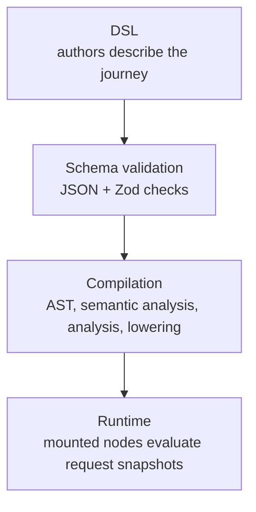

# Forge: Architectural Overview

## Purpose

Forge is a compiled journey engine for Node.js. It provides a declarative
authoring API for defining multi-step user journeys: sequences of pages, forms,
hooks, validation, and navigation logic.

Forge validates each journey, builds an internal representation of its
structure, and mounts route handlers through a framework adapter.

The framework targets government digital services built on
[Express](https://expressjs.com/), Nunjucks, and the
[GOV.UK Design System](https://design-system.service.gov.uk/), while keeping
the core engine independent of Express, Nunjucks, and any specific UI library.
Forge handles the structural concerns of journey delivery: route mounting, step
sequencing, conditional navigation, field validation, answer preparation,
reachability analysis, and component rendering orchestration. Most framework
changes therefore need to preserve both the declarative authoring model and the
compiled runtime model.

## Design principles

### Deterministic core evaluation

Forge's core evaluation model is deterministic and context-driven. Given the
same compiled journey, registries, request context, and pure function
implementations, the engine should reach the same validation, navigation,
hook, and rendering decisions every time. Any non-determinism should live at
the edges: effects, external integrations, request/session state, framework
adapters, or application code that loads data into context.

### Declarative over imperative

Journeys are defined as data structures, not request handlers. The public
builder API produces inspectable definitions; the engine decides how to execute
those definitions. Internal changes should preserve that separation so
validation, compilation, diagnostics, and tooling can continue to reason about
journeys before request handling starts.

### Compilation over interpretation

Forge turns definitions into intermediate representation (IR) in the form of an
Abstract Syntax Tree (AST). From here, runtime plans are built and JavaScript
functions are generated for each of the different phases that make up the
evaluation of a request. Runtime handlers then execute those compiled artefacts,
removing the need to interpolate the definition on every request - and keeping
the framework performant.

### Framework independence at the core

`forge-core` has no dependency on Express, Nunjucks, GOV.UK Frontend, or MOJ
Frontend. Web framework integration is handled through the `ForgeRenderer`
interface and `ResponseBindings`: the framework supplies a `RequestSnapshot` and
receives a `ForgeOutcome` back. Component rendering is handled through
`ComponentRegistryEntry` renderers.

### Stateless request evaluation

Forge does not keep durable journey state inside the framework runtime. Each
request is evaluated from the request, session, answers, data, and route context
provided to that request. If a journey needs persistence, caching, or external
state, that responsibility sits outside the core engine and is surfaced back to
Forge through the request evaluation context.

### Integration through context

Forge does not prescribe how services integrate with external systems. Data can
be loaded by application middleware, framework adapters, package functions, or
effects, but the engine only needs the resulting answers and data to be
represented in context. Once values are in context, Forge can evaluate
conditions, transformations, validation, reachability, hooks, and rendering
consistently across the request.

### Scoped isolation of packages

When multiple journeys are registered with a single `Forge` instance, each
package registration can carry its own functions and components without mutating
the global registries. A custom condition or component variant registered for
one package is not visible to another package unless it is registered globally.

### Fail fast, fail clearly

Journey definitions are validated before routes are mounted. Object definitions
are checked for JSON serialisability, string definitions are parsed as JSON.
Definitions are then validated using Zod schemas, and additional semantic based
rules are then checked (check that referenced functions exist, components are
registered, references are valid for their scope etc.)

Errors carry diagnostic metadata, such as DSL path, node ID, expected
value, function name, and component variant, so failures can be traced back to
the authored definition before runtime.

## High-Level architecture

### Pipeline stages

Every journey definition passes through four broad stages between authoring and
request handling:



1. **Authoring / DSL** describes a journey as a declarative object graph:
   journeys, steps, blocks, references, conditions, hooks, and outcomes.

2. **Schema validation** checks that the raw authored definition is serialisable
   and matches the broad Zod schemas.

3. **Compilation** builds the AST, runs semantic rules, derives compile-time
   dependencies, lowers those inputs into runtime functions, and builds route
   indexes.

4. **Runtime evaluation** uses mounted compiled artifacts to evaluate each
   request, decide access, navigation, validation, hooks, and rendering, then
   returns a `ForgeOutcome` for the framework adapter.

The source-adjacent engine docs are the source of truth for internals:
[engine/README.md](../packages/forge-core/src/engine/README.md),
[engine/compilation/README.md](../packages/forge-core/src/engine/chassis/compilation/README.md),
and [engine/runtime/README.md](../packages/forge-core/src/engine/chassis/runtime/README.md).

### Package structure

The library is published as one npm package, `@ministryofjustice/hmpps-forge`,
with eight export entry points declared in `packages/package.json`:

| Entry point | Source area | Role |
|---|---|---|
| `./core` | `forge-core` | `Forge` class, global registries, selected runtime-facing types |
| `./core/authoring` | `forge-core` | Builder API, definition types, conditions, transformers, generators, effects helpers |
| `./core/components` | `forge-core` | Component system interfaces and built-in components |
| `./core/framework` | `forge-core` | Renderer interface (`ForgeRenderer`), response bindings, snapshot/outcome/topology types, render context types, path utilities |
| `./core/testing` | `forge-core` | Testing helpers and types for exercising the engine |
| `./express-nunjucks` | `forge-express-nunjucks` | Express router adapter, Nunjucks renderer, Nunjucks helpers |
| `./govuk-components` | `forge-govuk-components` | GOV.UK Design System component implementations and authoring wrappers |
| `./moj-components` | `forge-moj-components` | MOJ Frontend component implementations and authoring wrappers |


```text
forge-core
  Standalone engine and public core APIs.
  No Express, Nunjucks, GOV.UK Frontend, or MOJ Frontend dependency.

forge-express-nunjucks
  Depends on forge-core, Express, and Nunjucks.
  Provides createExpressRouter and a NunjucksRenderer that implements the core
  ForgeRenderer interface, plus Nunjucks component helper utilities.

forge-govuk-components
  Depends on forge-core and the express-nunjucks helper.
  Provides GOV.UK component registry entries and wrappers rendered with
  Nunjucks.

forge-moj-components
  Depends on forge-core and the express-nunjucks helper.
  Provides MOJ component registry entries and wrappers rendered with
  Nunjucks/templates.
```

`forge-core` is the only source area with deep internal layering. The adapter
and component source areas mostly implement public extension interfaces from the
core. The GOV.UK and MOJ component packages are not framework-independent leaves
today because their renderers use Nunjucks component helpers from
`./express-nunjucks`.

### Layer Boundaries Within forge-core

```text
+-------------------------------------------------------------+
| Authoring                                                   |
| Builders, conditions, transformers, generators, definitions |
| Public API consumed by journey definitions                  |
+-------------------------------------------------------------+
| Components                                                  |
| Component interfaces, built-in components, block types      |
| Shared by authoring definitions and runtime rendering       |
+-------------------------------------------------------------+
| Framework                                                   |
| ForgeRenderer, response bindings, request/response types,   |
| path utilities                                              |
| Integration boundary for web frameworks                     |
+-------------------------------------------------------------+
| Engine                                                      |
|   contracts/            — shared types (no logic)           |
|   compilation/ast/      — AST construction                  |
|       (depends on contracts/)                               |
|   compilation/semantic-analysis/ — runs semantic rules on   |
|       the finalised AST (depends on contracts/ + ast/)      |
|   compilation/analysis/ — derives the            |
|       CompilationModel from the AST                          |
|       (depends on contracts/ + ast/)                        |
|   compilation/lowering/ — codegen from the plan             |
|       (depends on contracts/ + ast/, NOT                    |
|        analysis/, NOT runtime/)                  |
|   runtime/              — execution (depends on contracts/) |
|   + registries, validation, errors, diagnostics             |
|   ast/semantic-analysis/analysis/lowering        |
|       grouped under compilation/                            |
|   Layer boundaries enforced by eslint                       |
+-------------------------------------------------------------+
| Shared                                                      |
| Generic type guards and utilities used across core layers   |
+-------------------------------------------------------------+
```

Together, these layers keep Forge's responsibilities narrow: authoring defines
the journey shape, the engine validates and compiles it, framework adapters
translate HTTP concerns, and component packages handle presentation. Changes to
Forge should preserve those boundaries so the core evaluation model remains
deterministic, stateless, and independent of any one web or rendering stack.
