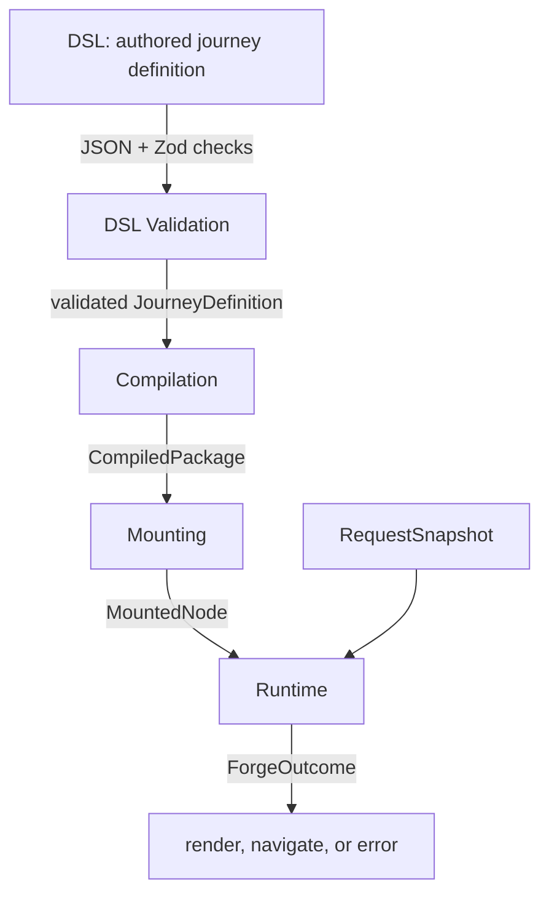
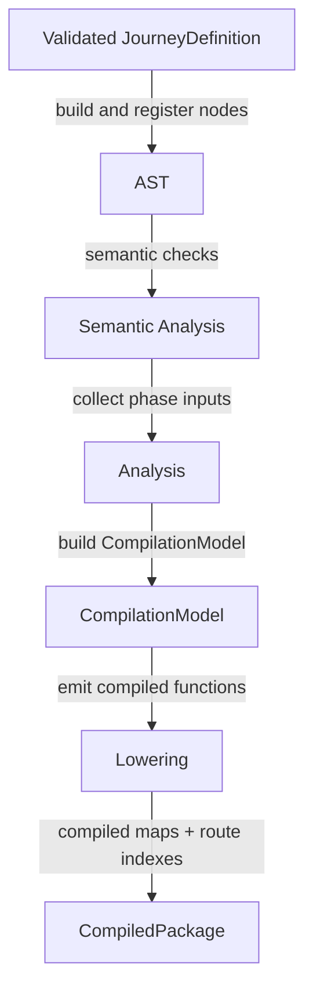
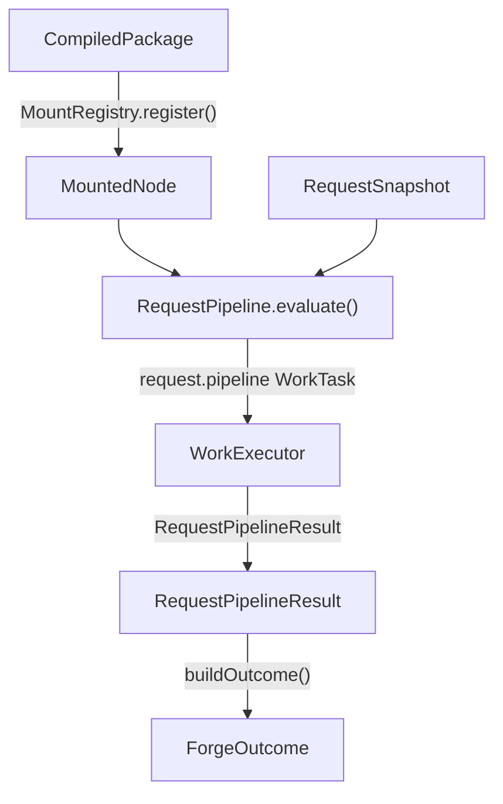

# Engine

The engine is the core Forge pipeline.

It takes an authored journey, checks it, compiles it, mounts it, and evaluates it for requests.
Most maintainers should understand the four broad stages and the eight concerns before changing a subsystem.

## The Shape

The engine has two axes.

The **stage** axis is the order work happens in. A journey is authored, checked, compiled once, then evaluated per
request. That order is fixed and every stage assumes the previous one's output.

The **concern** axis is the domain question being answered. Validation, reachability, resolve, and the rest each
have a compile-time half and a runtime half, and those halves only make sense read together.

The stage axis is the structure of [chassis/](chassis/) - `compilation/`, `runtime/`, and the substrate both
stages run on. The concern axis is the outer structure of everything else: each concern owns a vertical slice
under `concerns/<name>/`, with `analysis/`, `lowering/`, `runtime/`, and `contracts/` inside it. The stages
still exist; they are now the inner axis. DSL validation is the one concern with no stage folders - its whole
job happens before the AST exists.

## The Four Stages

1. Authors write a journey in the Forge DSL.
2. Schema validation checks the raw authored shape.
3. Compilation turns the validated journey into runtime artifacts.
4. Runtime evaluates those artifacts for one mounted request.

### DSL

The DSL is the author-facing shape.
It lives outside this folder under [../authoring](../authoring).

Authors describe journeys, steps, blocks, hooks, conditions, generators, transformers, predicates, and references as plain TypeScript objects and helper calls.
That shape is built for people first.
It keeps journey definitions readable, but it is not the shape the engine wants to execute directly.

Important entry points:

- [../authoring/types](../authoring/types) defines the authoring object shapes.
- [../authoring/builders](../authoring/builders) defines expression and reference builders.
- [../built-ins/functions/conditions](../built-ins/functions/conditions), [../built-ins/functions/generators](../built-ins/functions/generators), and [../built-ins/functions/transformers](../built-ins/functions/transformers) define built-in function sets.
- [../authoring/utils/deprecated](../authoring/utils/deprecated) contains helpers for defining functions and function scopes.

### DSL Validation

DSL validation is the first engine check.
It lives under [concerns/dsl-validation](concerns/dsl-validation).

This stage checks that the authored definition is JSON-compatible and matches the broad Zod schemas.
It catches shape errors before the compiler builds AST nodes.
For example, it can reject a malformed block, a wrong property type, or a value that cannot be safely serialized.

This stage does not know enough to answer semantic questions.
It cannot decide whether `Item()` is inside an iterator, whether an effect function is inside a hook, or whether a component variant is registered.
Those checks need compiler state.

Mechanically it runs as the first phase of the compilation pipeline, so it still happens before any AST node exists.

Read [concerns/dsl-validation/README.md](concerns/dsl-validation/README.md) for details.

### Compilation

Compilation turns a validated journey into runtime artifacts.
It lives under [chassis/compilation](chassis/compilation).

This stage builds the AST, validates semantic rules, gathers dependency inputs, lowers those inputs into compiled functions, and builds route indexes.
It pays that cost when a package is registered.
Request handling should not run any of this work.

The important output is `CompiledPackage`.
It contains route indexes plus compiled step and journey maps.
AST nodes, AST indexes, and compilation plans should not leave compilation.

Read [chassis/compilation/README.md](chassis/compilation/README.md) for details.

### Runtime

Runtime evaluates compiled artifacts for one request.
It lives under [chassis/runtime](chassis/runtime).

The framework layer selects a `MountedNode` and passes a `RequestSnapshot`.
`RequestPipeline.evaluate()` builds a request pipeline, executes work tasks, records traces, and returns a `ForgeOutcome`.

Runtime calls compiled functions.
It does not rebuild AST nodes, plans, route indexes, or generated source.
That boundary is important.
It keeps compiler cost and compiler failures out of request handling.

Read [chassis/runtime/README.md](chassis/runtime/README.md) for details.

## The Eight Concerns

Each concern under [concerns](concerns) owns its whole vertical slice: how its inputs are gathered at compile
time, how they are lowered into a compiled function, how that function is executed at request time, and the types
that cross between. A concern's folders are named for the stage they belong to, so `concerns/validation/lowering`
is lowering code that happens to be about validation, and the stage rules still apply to it.

Read in pipeline order, they are:

| Concern | Runtime phase | What it decides |
|---|---|---|
| [hooks](concerns/hooks/README.md) | `request.access`, `request.submit` | Whether authored lifecycle work halts, redirects, or branches the request |
| [answer-preparation](concerns/answer-preparation/README.md) | `request.answer-preparation` | What the request's values become in the answer store |
| [validation](concerns/validation/README.md) | `request.validities`, `request.entry-validation` | Which rules fail: reachability validity facts per step, and the current page's one displayed result |
| [reachability](concerns/reachability/README.md) | `request.reachability` | Which steps the user can reach, and where to send them if not this one |
| [answer-cleardown](concerns/answer-cleardown/README.md) | `request.answer-cleardown` | Which answers belong to steps no path can reach any more |
| [route](concerns/route/README.md) | `request.route-tree` | Where the request is in the route tree, and where a redirect target points |
| [resolve](concerns/resolve/README.md) | `request.resolve` | What the renderer receives as `RenderContext` |
| [render](concerns/render/README.md) | `request.render` | What the renderer produces for the page |

Concerns are isolated by default: no concern may import another. A small set of edges is sanctioned, and every
one of them is listed both in the importing concern's README and in the comment above the concern zones in
[eslint.config.mjs](../../eslint.config.mjs).

## The Chassis

Everything under [chassis/](chassis/) is the machinery that runs concerns in the right order without knowing
what any of them mean.

- [chassis/work](chassis/work) owns the stage-neutral work substrate: the executor, work context, and task helpers.
  Both stages run their pipelines through it - runtime asynchronously, compilation synchronously - and it imports neither.
- [chassis/compilation](chassis/compilation) owns phase order, the AST, semantic analysis, plan assembly, the expression and emitter layers, and generated-function construction.
- [chassis/runtime](chassis/runtime) owns the request pipeline order, the compiled-function contexts, and request trace projection.
- [chassis/contracts](chassis/contracts) owns the kernel types every layer shares: AST, compiled functions, plans, work, and runtime plumbing.
- [chassis/registries](chassis/registries) owns function, component, and mount registries.
- [chassis/tracing](chassis/tracing) owns the shared trace substrate and the instrumentation fan-out.

[concerns/dsl-validation](concerns/dsl-validation) also behaves like chassis: it runs the pre-AST JSON and Zod checks as the first compilation phase.

## Supporting Areas

- [Forge.ts](Forge.ts) is the public engine facade.
- [PackageInstance.ts](PackageInstance.ts) owns package-level registry scoping and compilation.
- [errors](errors) owns engine error types and formatting.

## Where To Start

- To follow the whole path, read this file, then [chassis/compilation/README.md](chassis/compilation/README.md), then [chassis/runtime/README.md](chassis/runtime/README.md).
- To change one domain question - validation, reachability, resolve - start at that concern's README and read its stage folders in order. You should not need to open another concern.
- To debug authoring shape errors, start in [concerns/dsl-validation](concerns/dsl-validation).
- To debug generated runtime behavior, start in the concern's `lowering/` folder and the matching `runtime/` folder next to it.
- To debug one request, start in [chassis/runtime/pipeline/RequestPipeline.ts](chassis/runtime/pipeline/RequestPipeline.ts) and [chassis/runtime/pipeline](chassis/runtime/pipeline).
