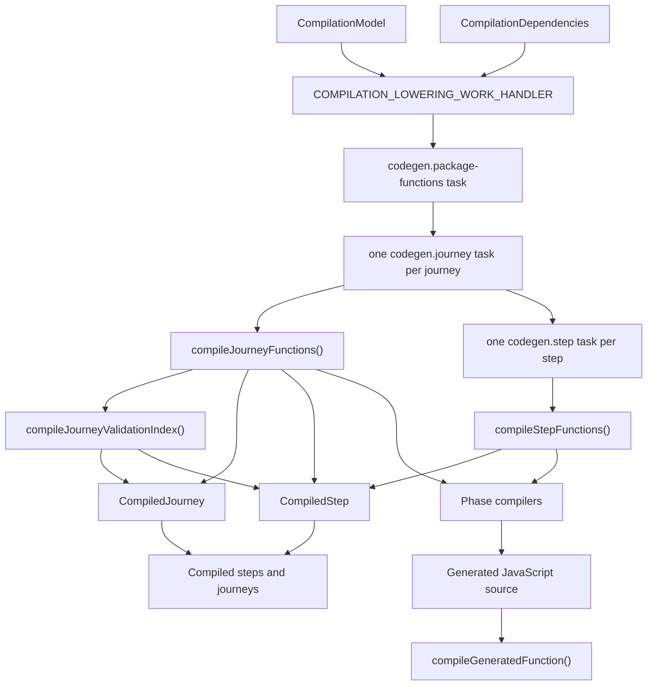

# Lowering

## Scope

This document covers `packages/forge-core/src/engine/chassis/compilation/lowering`.

This code turns a `CompilationModel` into compiled functions for journeys, steps, hooks, validation, answer preparation, resolve, and navigation.
It owns compile order, the shared emitter and expression layers, and the `new Function` boundary.

The phase compilers themselves live with their concern, under `concerns/<name>/lowering`.
This folder is what they are built out of and what drives them.

This document does not cover AST creation, semantic validation, analysis, route index construction, or runtime execution.

## Background

Lowering is the engine's code generation phase.

The earlier compiler phases have already built a registered AST and a `CompilationModel`.
Those structures are good for compiler code, but they are not what we want to interpret on every request.
Journeys can have many steps, nested blocks, iterator templates, predicates, hooks, and function calls.
Walking all of that structure for every request would repeat the same decisions again and again.

Lowering pays that cost once.
It writes JavaScript source for each runtime phase, compiles that source, and hands the compiled functions to the runtime.
For example, a field formatter becomes a direct call through `_forgeHelpers.evaluateFunction(...)`.
A validation rule becomes a generated function that builds validation work tasks.
A navigation plan becomes a generated function that evaluates reachability and forward outcomes.
Generated functions do not usually run their child work directly.
They return `WorkTask` objects through `ctx.workTasks`, and the runtime work executor decides how to run those tasks.

"Is this just runtime logic built out of strings?" The final output is JavaScript source, but compilers do not assemble it as strings.
They build typed `CodeFragment`, `IdentifierName`, and statement nodes through `CodeGenerator`, following the same safe-fragment approach as Ajv's code generator.
`SourceRenderer` turns that IR into source and source-map segments in one pass, and the result is tested both as source and as executable functions.
The runtime executes the compiled functions later; lowering does not run request lifecycles itself.

We also prefer to build as functions because it simplifies some of the sync/async handling that can come with
the whole 'build your own functions' approach, and we also get the benefits of V8/TurboFan optimizing our functions
under heavy-load - so Forge remains performant!

## Responsibilities

- Compile every `StepCompilationInputs` entry into a `CompiledStep`.
- Compile every `JourneyCompilationInputs` entry into a `CompiledJourney`.
- Compile every `ReachabilityCompilationInputs` entry into a `CompiledReachabilityFactsFunction`.
- Compile the `RouteMetadataModel` entries into one package-level `compiledRouteMetadata` function.
- Emit inspectable JavaScript source for phase compilers.
- Construct sync or async functions based on discovered `await` usage.
- Build generated functions that return `WorkTask`s instead of running child work directly.
- Pass the runtime library into generated functions through `_forgeHelpers`.
- Attach runtime diagnostics so generated failures can point back to AST nodes and DSL paths.
- Keep generated-function construction errors separate from runtime evaluation errors.

## Data Model

`CompilationDependencies` contains the registries lowering needs while generating source:
- `functionRegistry`, used by `ExpressionDispatcher` to decide whether generated function calls need `await`.
- `componentRegistry`, carried with the lowering dependencies for compilers that need component metadata.

`CompilationModel` is the input from analysis.
The lowering phase handler consumes it and the codegen tasks fill:
- `steps`, a `Map<NodeId, CompiledStep>` on `CompilationState`.
- `journeys`, a `Map<NodeId, CompiledJourney>` on `CompilationState`.

`CompiledStep` contains the step runtime plan, the step-owned compiled functions, and the journey-scoped and package-scoped compiled functions/indexes it needs at runtime.
Step-owned functions include step access lifecycle, submit hooks, answer preparation, submit validation, entry validation, and resolve.
Journey-scoped fields include reachability facts, reachability state, field inventory, and `compiledStepValidations`.
The package-scoped field is `compiledRouteMetadata`, shared by every step and journey in the package.

`CompiledJourney` contains the journey runtime plan and journey-owned compiled functions/indexes, plus the package-scoped `compiledRouteMetadata`.
Journey-owned functions include reachability facts, reachability state, field inventory, static data, access lifecycle, and answer preparation.
`compiledStepValidations` is a journey-scoped index of validating step ids to step-specific validation functions.

Most compiled functions return a `WorkTask` or a promise of one.
The task describes what should happen next: the handler kind, the task key, the props, and any child tasks.
For example, validation returns a step validation task that contains field and domain validation tasks.
Resolve returns a resolve-blocks task that contains resolve-block tasks.

Generated functions are created by `compileGeneratedFunction()`.
It wraps source with runtime diagnostics, passes `_forgeHelpers` and `_forgeRuntimeDiagnostics` as extra parameters that the compiled wrapper supplies on each call, and calls `createCompiledFunction()` with either `Function` or `AsyncFunction`.

The source is captured before the `Function` construction, so a failed compile still carries the source that produced it.

The main source-building helpers are:
- `CodeGenerator`, which owns structured statements, functions, scopes, and variable names.
- `CodeFragment` and `IdentifierName`, which keep executable fragments distinct from literal values.
- `SourceRenderer`, which renders source and authored-position segments directly from the IR.
- `ExpressionDispatcher`, which compiles expressions and tracks iterator scope, `@self`, and `usesAwait`.
- `RuntimeValueCompiler`, which materialises classified `AuthoredValue` trees into runtime values.
- `ScopedTemplateCompiler`, which reconstructs iterator loop nests and compiled template instance IDs.
- `IteratorLoopEmitter`, the single home of the emitted iterator loop both structures delegate to.
- `DiagnosticEmitter`, which wraps expressions and function calls with node and source metadata.

### Example

An authored field can trim a submitted value:

```ts
field({ code: 'name', formatters: [Transformer.String.Trim()] })
```

After AST creation and analysis, `StepAnswerPreparationCompiler` receives a `FieldBlockASTNode` whose
formatter is a `FunctionType.Transformer` node. It emits source shaped like this:

```js
(ctx, _forgeHelpers, _forgeRuntimeDiagnostics) => {
  "use strict";

  const isPost = ctx.request.method === "POST";
  const fieldPreparations = [];

  if (isPost) {
    const answerHistory = _forgeHelpers.ensureAnswerHistory(ctx, "name");
    let rawValue = _forgeHelpers.normalizePostValue(ctx.post["name"], false);
    _forgeHelpers.pushAnswerMutation(answerHistory, rawValue, "post");

    let formattedValue = rawValue;
    const formatterResult = _forgeHelpers.evaluateFunction(
      ctx,
      _forgeRuntimeDiagnostics,
      {
        nodeId: "compile_ast:7",
        functionName: "Trim",
        functionType: "FunctionType.Transformer",
      },
      "Trim",
      [formattedValue],
    );

    if (formatterResult !== undefined) {
      formattedValue = formatterResult;
    }
    if (formattedValue !== rawValue) {
      _forgeHelpers.pushAnswerMutation(answerHistory, formattedValue, "processed");
    }
  }

  return ctx.workTasks.answerPreparation(fieldPreparations);
}
```

The important transform is not just the formatter call.
The compiler has also chosen the request branch, answer-history mutation order, helper call shape,
diagnostic metadata, and sync/async function constructor.
The returned `ctx.workTasks.answerPreparation(...)` value is part of that transform.
The generated function builds the work description; it does not execute the answer-preparation handler itself.

## Flow

Lowering starts when the work executor runs the `lowering` task.
`COMPILATION_LOWERING_WORK_HANDLER` reads the `CompilationModel` off `CompilationState` and fans out into one `codegen.package-functions` task plus one `codegen.journey` task per journey, and each journey task fans out into its `codegen.step` tasks - all sequential.
The task handlers construct `CodegenOrchestrator` with `CompilationDependencies` (the registries) and call its compile methods.
For each journey, it compiles journey functions and the journey validation index from plan inputs, then the step tasks compile step functions.
The final step artifacts receive their step-owned functions plus the journey-scoped functions/indexes they need at runtime.



- [CompilationLoweringWorkHandler.ts](CompilationLoweringWorkHandler.ts) exports the lowering phase handler and the codegen task handlers; [CodegenOrchestrator.ts](CodegenOrchestrator.ts) owns compile order.
  The order follows ownership: package scope, journey scope, then step scope.
  Child scopes may receive parent-scoped compiled functions at assembly time, but parent scopes do not depend on compiled child artifacts.
- The phase compilers `CodegenOrchestrator` drives live in their concerns.
  Each concern's `lowering/README.md` explains what its compiler emits and what work the generated function returns:
  [answer-preparation](../../../concerns/answer-preparation/lowering/README.md),
  [hooks](../../../concerns/hooks/lowering/README.md),
  [reachability](../../../concerns/reachability/lowering/README.md),
  [resolve](../../../concerns/resolve/lowering/README.md),
  [route](../../../concerns/route/lowering/README.md), and
  [validation](../../../concerns/validation/lowering/README.md).
- [expressions/ExpressionDispatcher.ts](expressions/ExpressionDispatcher.ts) is the shared expression entry point used by the phase compilers.
- [GeneratedFunctionCompiler.ts](GeneratedFunctionCompiler.ts) wraps generated source, attaches diagnostics, injects the runtime library, and constructs the executable function.

## Boundaries

- `CodegenOrchestrator` owns phase compile order.
  It should not contain source-emission details.
- Phase compilers own the generated source for one runtime phase.
  They should not query the AST for missing inputs that analysis should have provided.
  They live in their concern's `lowering/` folder, not here.
- `ExpressionDispatcher` owns expression-shaped source.
  Phase compilers should use it for nested expressions instead of hand-writing expression dispatch.
- `RuntimeValueCompiler` owns materialising classified `AuthoredValue` trees into runtime values.
  It is a pure switch over the value kind; the only policy hook is `compileBlockValue`, which the resolve
  concern supplies for nested block values (every other concern treats a block value as an impossible state).
- `ScopedTemplateCompiler` owns iterator loop-nest reconstruction from model `iteratorPath`s.
  Phase compilers should not each implement their own `Item()` and `Loop` stack; the loop body emission
  itself lives in `IteratorLoopEmitter`.
- `ScopedTemplateCompiler` owns compiled template block IDs.
  Template block IDs are built from the template node ID and active iterator index path.
  Field code is answer identity and metadata, not render block identity.
- `GeneratedFunctionCompiler` owns the `new Function` boundary.
  Other lowering code should return source strings or compiled functions through this helper.
- Lowering emits executable functions.
  It should not execute request lifecycles or call runtime work handlers.
- Generated functions build `WorkTask` graphs.
  They should describe child work through `ctx.workTasks.*`, not run child handlers directly.

## Quirks

- Generated functions close over nothing useful.
  Everything they need is passed in when the runtime calls them: request state, helper functions, and diagnostic state.
  That keeps a compiled function portable. It can sit on a compiled step or journey without secretly
  depending on the compiler instance that created it.
- Compiled functions usually return work, not final phase output.
  The runtime executor owns sequencing, concurrency, first-match behavior, tracing, and completion.
- Compiled functions don't run their children.
  As above, the runtime executor handles this. By returning `WorkTasks`, we can properly track runtime work, super
  inspired by React's Fiber model.
- Async is discovered during expression compilation.
  `ExpressionDispatcher.usesAwait` flips when a registered async function is compiled, and `compileGeneratedFunction()` chooses `AsyncFunction`.
- Hook lifecycles force async.
  Effects are awaited even when the current hook list does not visibly contain an async function.
- Journey reachability is compiled at journey scope.
  The compiled reachability state function closes over that journey's `ReachabilityStateTable`, and compiled step artifacts receive the journey-scoped reachability functions during assembly.
- `compiledStepValidations` is compiled at journey scope.
  Each entry is keyed by a validating step id and points at a validation function compiled from that step's validation inputs.
  Non-validating steps are intentionally absent from the index, even though each final step artifact has a no-op-capable `compiledValidation` function.
- Direct function expressions are not wrapped twice for diagnostics.
  `ExpressionDispatcher` lets `_forgeHelpers.evaluateFunction()` carry function metadata instead of adding an outer `evaluateTracked()` wrapper.
- `CodeGenerator` tracks lexical and function-scoped names differently.
  `var` names cannot be reused across sibling scopes, but `const` and `let` names can when their scopes do not overlap.

## Constraints

- Keep lowering after analysis.
  Phase compilers expect explicit inputs, not raw AST discovery.
- Keep lowering before runtime execution.
  The runtime consumes compiled functions and work tasks; it should not generate source.
- Use `compileGeneratedFunction()` for generated functions.
  Bypassing it loses helper injection, async selection, diagnostics, and `ForgeCompilationError` wrapping.
- Reset `ExpressionDispatcher` for each generated function.
  Iterator frames, `@self`, local variable counters, and `usesAwait` are per-function state.
- Preserve generated diagnostics.
  Runtime errors need node IDs, function names, function types, and DSL source paths to be useful.
- Preserve the codegen task ordering in `CompilationLoweringWorkHandler.ts`.
  Keep parent scopes before child scopes: package, journey, then step.
  Do not make journey compilation depend on compiled step artifacts.
- Do not import runtime implementation details into lowering.
  Lowering should emit calls to work-task factories and helper interfaces, not execute runtime handlers directly.
- Do not make generated functions call child work directly.
  Returning `WorkTask`s keeps execution order, tracing, and failure handling in the runtime work executor.
- Keep generated source readable.
  Tests and production diagnostics depend on source that can be inspected when a generated function fails.

## Editing Notes

- To add a new compiled output, start with the output type in `contracts/`, then add the input shape in `CompilationModel`,
  then add a phase compiler and wire it through `CodegenOrchestrator`.
- To change expression syntax, start in `ExpressionDispatcher`.
  Add a sibling compiler when the expression has a distinct shape, then route it from `dispatchExpression()`.
- To change function call emission, start in `PipelineNodeCompiler.compileFunction()` and `DiagnosticEmitter`.
  Keep function metadata attached for runtime diagnostics.
- To change generated variable naming, start in `CodeGenerator`; for indentation and layout, start in `SourceRenderer`.
  Keep phase compilers on typed `CodeFragment` and structured nodes rather than hand-formatting source.
- To change iterator template behavior, start in `ScopedTemplateCompiler`.
  Then check answer preparation, validation, resolve, and field inventory.
- To change template block identity, keep resolve and validation on `ScopedTemplateCompiler.compileTemplateInstanceIdExpression()`.
  Do not derive block IDs from field code.
- To change how dynamic block property values are built, start in `RuntimeValueCompiler`.
  Pass phase-specific behavior through its policy hooks (the optional methods on `RuntimeValueCompilerPolicy`).
- To change answer preparation, hook, reachability, resolve, or validation output, start in that phase compiler and its colocated tests.
- To debug generated output, call the relevant `generateSource()` method in a phase compiler test.
- We'd recommend maybe doing a bit of research on this codegen approach, AJV and Nunjucks have some great
  documentation on this, which inspired our approach!

## Entry Points

- [CompilationLoweringWorkHandler.ts](CompilationLoweringWorkHandler.ts) runs the full `CompilationModel` through the lowering and codegen tasks.
- [CodegenOrchestrator.ts](CodegenOrchestrator.ts) is the compile-order facade those tasks drive.
- [compilationDependencies.type.ts](compilationDependencies.type.ts) defines the registries available during lowering.
- [GeneratedFunctionCompiler.ts](GeneratedFunctionCompiler.ts) wraps source, injects the runtime library, and compiles generated functions.
- [generatedFunctionRuntimeLibrary.ts](generatedFunctionRuntimeLibrary.ts) is the runtime library injected into generated source as `_forgeHelpers`.
- [codegen/CodeGenerator.ts](codegen/CodeGenerator.ts) builds structured generated-code IR with scoped names.
- [codegen/rendering/SourceRenderer.ts](codegen/rendering/SourceRenderer.ts) renders readable JavaScript and source-map segments.
- [emitters/DiagnosticEmitter.ts](emitters/DiagnosticEmitter.ts) emits runtime diagnostic wrappers.
- [emitters/FieldCodeEmitter.ts](emitters/FieldCodeEmitter.ts) emits field-code expressions for answers, metadata, and `Self()`.
- [expressions/ExpressionDispatcher.ts](expressions/ExpressionDispatcher.ts) compiles AST and template expressions.
- [structures/RuntimeValueCompiler.ts](structures/RuntimeValueCompiler.ts) turns authored values into the runtime values used at request time.
- [structures/ScopedTemplateCompiler.ts](structures/ScopedTemplateCompiler.ts) emits iterator/template traversal and template instance IDs.
- [../../concerns/answer-preparation/lowering/StepAnswerPreparationCompiler.ts](../../../concerns/answer-preparation/lowering/StepAnswerPreparationCompiler.ts) compiles answer-preparation work.
- [../../concerns/hooks/lowering/HookLifecycleCompiler.ts](../../../concerns/hooks/lowering/HookLifecycleCompiler.ts) compiles access and submit hook work.
- [../../concerns/reachability/lowering/ReachabilityCompiler.ts](../../../concerns/reachability/lowering/ReachabilityCompiler.ts) compiles reachability and navigation work.
- [../../concerns/answer-cleardown/lowering/StepFieldInventoryCompiler.ts](../../../concerns/answer-cleardown/lowering/StepFieldInventoryCompiler.ts) compiles the step field inventory the reachability phase evaluates on step requests.
- [../../concerns/resolve/lowering/StepResolveCompiler.ts](../../../concerns/resolve/lowering/StepResolveCompiler.ts) compiles resolve/render work.
- [../../concerns/route/lowering/RouteMetadataCompiler.ts](../../../concerns/route/lowering/RouteMetadataCompiler.ts) compiles route metadata for the route tree.
- [../../concerns/validation/lowering/StepValidationCompiler.ts](../../../concerns/validation/lowering/StepValidationCompiler.ts) compiles step-validation work.
- [../../concerns/validation/lowering/EntryValidationCompiler.ts](../../../concerns/validation/lowering/EntryValidationCompiler.ts) compiles the entry-validation group selector.
