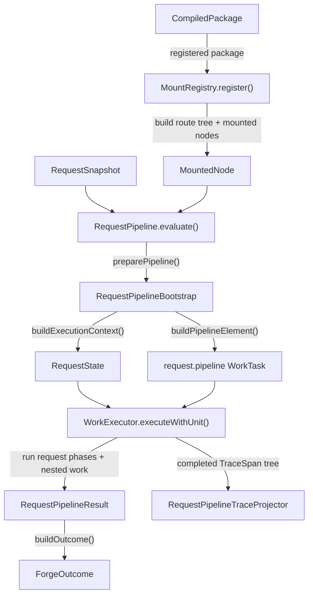
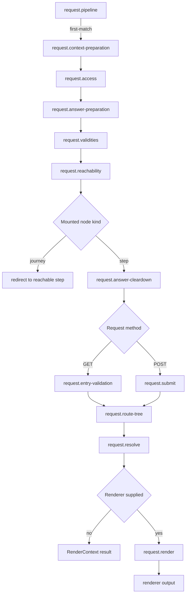

# Runtime

## Scope

This document covers `packages/forge-core/src/engine/chassis/runtime`.

This code executes compiled Forge journeys for one mounted node and one `RequestSnapshot`.
It builds request work, orders the runtime phases, runs them through the work executor, records traces, and returns a `ForgeOutcome`.

The phases themselves live with their concern, under `concerns/<name>/runtime`.
This folder owns the order they run in and the machinery they run on.

This document does not cover phase internals, compilation, package loading, authoring schema validation, framework adapter routing, or component implementation.

## Background

Runtime is where a compiled Forge journey answers a real request.

Compilation has already produced `CompiledStep`, `CompiledJourney`, route indexes, and generated functions.
Mounting has already turned those compiled artifacts into `MountedNode` values.
That still is not a final response.
Runtime must copy request state into `RuntimeContext`, run access checks, prepare answers, evaluate reachability, hydrate the route tree, resolve render blocks, and either redirect, error, or render.

For example, a step `POST` cannot just call the step's resolve function.
It needs prepared answers first.
It needs eager step validities before reachability.
It needs submit hooks before render.
It needs validation failures attached to rendered fields by block ID.

Runtime does not rebuild compiler state.
It consumes mounted compiled artifacts and request snapshots.
No AST nodes, `CompilationModel`, lowering, or registration should appear in this layer.

## Responsibilities

- Evaluate one `RequestEvaluationRequest`.
- Build a `RequestState` for the request.
- Build and run the root `request.pipeline` task.
- Run request phases in the correct order for journey, step `GET`, and step `POST`.
- Execute nested phase work through `WorkExecutor`.
- Mutate `RuntimeContext` only for request-time state.
- Record request traces through `RequestPipelineTraceProjector`.
- Convert `RequestPipelineResult` into `ForgeOutcome`.
- Build route-tree lookup data from compiled route indexes during mounting support.
- Keep compiler artifacts out of request execution.

## Data Model

`RequestPipeline` is the root runtime entry point.
It accepts a `RequestEvaluationRequest` and returns a `ForgeOutcome`.

`RequestEvaluationRequest` contains:
- `node`, the `MountedNode` selected by the framework layer.
- `snapshot`, the `RequestSnapshot` for the current request.
- `responseBindings`, used by effect hooks.
- `renderer`, optional component rendering support.

`MountedNode` is created by `MountRegistry`.
It carries compiled functions, registries, route data, and static data for either a step or a journey.
Both step and journey nodes carry the reachability pair `compiledReachabilityFacts` and `compiledReachabilityState`; step nodes add step-only functions such as `compiledSubmitHooks`, `compiledEntryValidation`, `compiledValidation`, and `compiledResolve`.
Both node kinds also carry `compiledStepValidations`, the journey-scoped index of validating step ids to step-specific validation functions.
When reachability checks are disabled for the journey, this index is empty because reachability does not need eager cross-step validities.

`RuntimeContext` is the mutable state for one request.
It has three branches:
- `request`, copied from `RequestSnapshot`.
- `domain`, with `data` and `answers`.
- `evaluation`, with reachability validities, reachability, and answer-cleardown state.

`RequestState`, in [pipeline/RequestState.ts](pipeline/RequestState.ts), wraps `RuntimeContext`.
It adds request-phase signals such as `reachabilityEvaluation`, `currentPageValidation`, `renderContext`, `renderedBlocks`, and `pipelineResult`.
It also carries `functionRegistry`, `responseBindings`, `currentStepId`, `hasRenderer`, `buildStepValidation()`, and `recordStepValidation()`.

`WorkTask` is the runtime execution unit.
Compiled functions and request phases return work tasks instead of directly running every child operation.
`WorkExecutor` runs those tasks and returns completed work.

`RequestPipelineResult` is the request pipeline output.
It is one of:
- `render`, with a `RenderContext` and optional renderer output.
- `redirect`, with a target path.
- `error`, with status and message.

`ForgeOutcome` is the public runtime output.
`RequestPipeline.buildOutcome()` turns redirects into navigation URLs, errors into error outcomes, and render results into render outcomes.

Route-tree state is built before request execution.
`RouteTreeBuilder`, in the [route](../../concerns/route/README.md) concern, builds `RouteTreeIndex`, `StoredRouteTree`, `JourneyRouteTemplateCatalog`, `JourneyRouteContext`, and `StepRouteContext` from compiled route indexes.
`MountRegistry` uses those structures to create mounted nodes.

## Flow

Runtime starts with a mounted node.
The framework layer has already matched a route and chosen the node.
`RequestPipeline.evaluate()` builds a request pipeline, runs it as work, projects traces, then converts the result.

The request pipeline then runs phase work.
The phase list depends on whether the mounted node is a journey or step, and whether the request method is `GET` or `POST`.

Runtime has a deliberate symmetry with compilation, but the phases do different jobs.
Compilation chooses what work exists.
Runtime executes that work against one request.

| Concern | Compiled artifact | Runtime phase |
|---|---|---|
| [hooks](../../concerns/hooks/README.md) | `compiledAccessLifecycle` | `request.access` runs `access.lifecycle` |
| [answer-preparation](../../concerns/answer-preparation/README.md) | `compiledAnswerPreparation` | `request.answer-preparation` runs `answer.preparation` |
| [validation](../../concerns/validation/README.md) | `compiledStepValidations` journey index, `compiledEntryValidation` | `request.validities` runs `validation.step` tasks when reachability checks are enabled; `request.entry-validation` triggers `validation.current-step` |
| [reachability](../../concerns/reachability/README.md) | `compiledReachabilityFacts` + `compiledReachabilityState` | `request.reachability` evaluates reachability and resolves redirects |
| [answer-cleardown](../../concerns/answer-cleardown/README.md) | `compiledFieldInventory` | `request.reachability` evaluates it on step requests; `request.answer-cleardown` clears stale answers against the projection built from it |
| [hooks](../../concerns/hooks/README.md) | `compiledSubmitHooks` and `compiledValidation` | `request.submit` runs submit hooks and validation |
| [route](../../concerns/route/README.md) | `compiledRouteMetadata` | `request.route-tree` resolves route metadata and hydrates the route tree |
| [resolve](../../concerns/resolve/README.md) | `compiledResolve` | `request.resolve` builds `RenderContext` |
| [render](../../concerns/render/README.md) | `componentRegistry` and `renderer` | `request.render` renders blocks and assembles output |

- [RequestPipeline.ts](pipeline/RequestPipeline.ts) owns runtime entry, pipeline execution, trace projection, and outcome conversion.
- [pipeline/README.md](pipeline/README.md) covers request phase order and cross-phase request state.
- [../work/README.md](../work/README.md) covers `WorkTask`, `WorkExecutor`, child groups, and work traces.
  The work substrate is stage-neutral and shared with compilation; runtime is its asynchronous caller.
- [context](context) builds the compiled-function contexts each phase passes to its compiled function.
- [../concerns](../../concerns) holds the phase handlers themselves, one folder per concern.
- [../concerns/route/runtime/RouteTreeBuilder.ts](../../concerns/route/runtime/RouteTreeBuilder.ts) builds route-tree data used by mounting and route-aware render context.

## Boundaries

- `RequestPipeline` owns request execution from mounted node to `ForgeOutcome`.
  It should not choose routes, compile packages, or implement phase rules.
- `RequestPipelineBootstrap` owns request pipeline construction.
  It should not execute the pipeline.
- `WorkExecutor`, in [../work](../work), owns work execution mechanics for both stages.
  It should not know about request phase semantics, hooks, validation, or rendering.
  Runtime owns the request pipeline order and the phase handlers, not the executor itself.
- Request work handlers own request-level orchestration.
  They should call compiled functions and phase tasks, not recreate compiler decisions.
  They live in their concern's `runtime/` folder; only `RequestContextPreparationWorkHandler` is chassis, because copying the snapshot belongs to no concern.
- Phase work handlers own phase-specific runtime behavior.
  They should not alter request phase order.
- `RuntimeContext` owns request-time state.
  It should not store compiler-only structures.
- `RouteTreeBuilder` owns route tree construction from compiled route indexes.
  It should not resolve request outcomes.
- `MountRegistry` owns mounted node creation.
  Runtime should receive a `MountedNode`, not raw compiled maps.

## Quirks

- `request.pipeline` uses `first-match`.
  Redirects, errors, and render results stop later phases from running.
- Compiled functions usually return `WorkTask`s.
  They do not directly call every child operation, because the runtime executor owns ordering, concurrency, tracing, and output folding.
- Resolve can be terminal.
  Without a renderer, `request.resolve` returns a `RenderContext` as the render result.
  With a renderer, resolve stores `renderContext` and `request.render` produces renderer output.
- Step and journey requests share the early pipeline.
  Journey requests stop at reachability and redirect to a reachable step.
- Field validation failures attach to render blocks by `blockId`.
  Field code is answer identity and debug metadata, not render block identity.
- Route tree construction allows a step route to occupy the same template path as a journey route.
  Other duplicate concrete routes throw `ForgeDuplicateRouteError`.

## Constraints

- Do not run compilation during runtime execution.
  Request handling must consume mounted compiled functions, route data, registries, and plans.
- Do not expose AST nodes, `ASTNodeIndex`, `CompilationModel`, or lowering details to runtime.
  Runtime state should only carry compiled artifacts and request-time values.
- Keep `RequestPipelineBootstrap` as the source of request phase order.
  Splitting order decisions across handlers makes `GET`, `POST`, and journey behavior hard to reason about.
- Keep `request.context-preparation` first.
  Later phases read request data, params, post data, session, headers, cookies, and static data.
- Keep access before request phases that can mutate or render state.
  Access must be able to halt before answer preparation, validation, submit hooks, resolve, or render.
- Keep validities before reachability.
  Reachability reads validation state when forward movement is validation-gated.
  When reachability checks are disabled, the phase still runs in this position but has no eager step validations to execute.
- Keep resolve before render.
  Render requires the `RenderContext` created by resolve.
- Preserve `WorkTask` child order in completed output.
  Validation display order, render prop replacement, and trace readability depend on it.
- Do not continue after a terminal `PhaseWorkOutput`.
  Later phases may mutate answers, session, validation, or render state after the request has already decided an outcome.
- Keep `NodeId` as the join key between mounted nodes, compiled artifacts, route catalogs, validation state, and render block identity.
  Route paths and authored codes are not safe substitutes.

## Editing Notes

- To change runtime entry behavior, start in [RequestPipeline.ts](pipeline/RequestPipeline.ts).
  Keep route selection outside this class.
- To change request phase order, start in [pipeline/RequestPipelineBootstrap.ts](pipeline/RequestPipelineBootstrap.ts).
  Check journey, step `GET`, and step `POST` paths together.
- To add a new request phase, add its request phase props, add the request handler with its co-located `create<X>Task` builder, and wire it in `RequestPipelineBootstrap`.
  Then document the phase in [pipeline/README.md](pipeline/README.md).
- To change work execution behavior, start in [../work/WorkExecutor.ts](../work/WorkExecutor.ts).
  Update order, failure, and trace tests together, and remember compilation runs on the same executor.
- To change a phase's internal behavior, start in that concern's `runtime/` folder under [../concerns](../../concerns).
  Keep request ordering rules in request evaluation.
- To change render block attachment, start in [../concerns/resolve/runtime/RequestResolveWorkHandler.ts](../../concerns/resolve/runtime/RequestResolveWorkHandler.ts) and the resolve concern docs.
  Keep matching by block ID.
- To change route tree shape, start in [../concerns/route/runtime/RouteTreeBuilder.ts](../../concerns/route/runtime/RouteTreeBuilder.ts) and route tree contracts.
  Then check mounted node creation in `MountRegistry`.
- To change trace output, start in [pipeline/RequestPipelineTraceProjector.ts](pipeline/RequestPipelineTraceProjector.ts) and [pipeline/contextSnapshot.ts](pipeline/contextSnapshot.ts).

## Entry Points

- [RequestPipeline.ts](pipeline/RequestPipeline.ts) answers how one mounted request becomes a `ForgeOutcome`.
- [pipeline/README.md](pipeline/README.md) explains request pipeline order and `RequestState`.
- [../work/README.md](../work/README.md) explains the work executor and trace tree.
- [../concerns](../../concerns) explains what each phase actually does, one README per concern.
- [../concerns/route/runtime/RouteTreeBuilder.ts](../../concerns/route/runtime/RouteTreeBuilder.ts) answers how compiled route indexes become runtime route-tree data.
- [../registries/MountRegistry.ts](../registries/MountRegistry.ts) answers how compiled package artifacts become `MountedNode` values.
- [pipeline/RequestState.ts](pipeline/RequestState.ts) defines `RequestState`; [../contracts/runtime/requestPipelineOutput.type.ts](../contracts/runtime/requestPipelineOutput.type.ts) defines `PhaseWorkOutput` and `RequestPipelineResult`.
- [../contracts/runtime/evaluationState.type.ts](../contracts/runtime/evaluationState.type.ts) defines `RuntimeContext`.
- [../contracts/work/work.type.ts](../contracts/work/work.type.ts) defines `WorkTask`, `WorkHandler`, `WorkGroup`, and `CompletedWork`.
