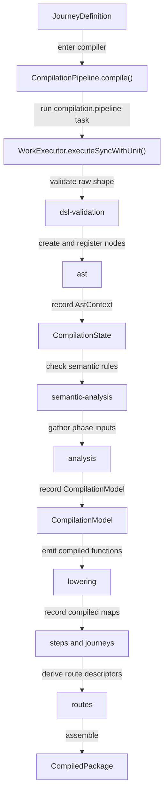
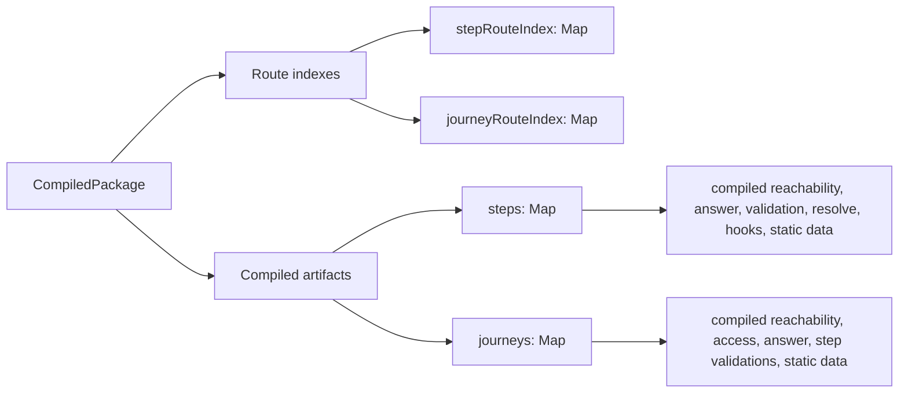

# Compilation

## Scope

This document covers `packages/forge-core/src/engine/compilation`.

This code turns an authored Forge journey definition into compiled journey artifacts.
It validates the raw shape, builds the AST, validates compiler-only rules, builds phase inputs, lowers those inputs into executable functions, and builds route indexes.
The phases run as a work-task tree through the same `WorkExecutor` that runs requests, executed synchronously.

This document does not cover authoring helpers, the Zod rules themselves, runtime request execution, work execution mechanics, or component rendering.

## Background

Compilation is the bridge between authored Forge configuration and runtime execution.

Authors write journeys as nested objects and DSL helpers.
That shape is useful for people, but the engine needs something more explicit before it can answer request-time questions.
For example, it needs to know which steps belong to each journey, which hooks apply to a step, which fields can affect reachability, and which generated function should prepare answers or resolve blocks.

The compiler pays that cost once when a package is loaded.
It turns the raw journey into registered AST nodes, checks rules that the schema cannot know, builds phase-specific dependency bundles, and compiles request-time work into functions.
The runtime can then look up a compiled step or journey by `NodeId` and call the functions it needs.

Compilation does not run a journey.
It builds the route indexes, runtime plans, compiled functions, and work-task-producing functions that later runtime code uses when a request arrives.
No part of compilation should run during request handling.
Runtime receives `CompiledPackage` and executes what is already there.

## Responsibilities

- Accept an authored `JourneyDefinition` and validate its raw shape first.
- Build and register the AST for the journey.
- Validate semantic rules that depend on AST structure and registries.
- Build a `CompilationModel` from registered AST nodes.
- Lower the `CompilationModel` into `CompiledStep` and `CompiledJourney` maps.
- Build `StepRouteIndex` and `JourneyRouteIndex` from the AST.
- Return a `CompiledPackage`.
- Run the phases as one synchronous work-task tree and emit the compilation trace from it.
- Keep phase orchestration in one place without moving phase-specific rules into the root pipeline.

## Data Model

`CompilationPipeline`, in [pipeline](pipeline), is the root compiler orchestrator.
It accepts a `JourneyDefinition` and returns a `CompiledPackage`.
Under the hood it builds a `CompilationState`, runs the `compilation.pipeline` work task through `WorkExecutor.executeSyncWithUnit()`, emits the compilation trace, and assembles the result.

`CompilationDependencies` carries what the phases need while compiling:
- `functionRegistry`, used to validate function names and decide generated async behavior.
- `componentRegistry`, used to validate block variants and component metadata.

`CompilationState`, in [pipeline/CompilationState.ts](pipeline/CompilationState.ts), is the draft the phases build up.
Each phase records its output - the `AstContext` (root `JourneyASTNode` plus `ASTNodeIndex`), the `CompilationModel`, the compiled artifact maps, the route indexes - and later phases read it back.
Its getters throw when read before the owning phase has run, because the phase order is fixed and a missing value is a pipeline bug.
Like the AST, it never leaves compilation.

Parent and ancestor lookup happens through the `parent` link on each registered node, not through a separate tree structure.

`CompilationModel` is produced by analysis.
It contains `stepInputs`, `journeyInputs`, and `reachabilityInputs`.
Those maps are shaped around lowering phases.

`CompiledPackage` is the final output.
It contains:
- `journeyCode`, copied from the root journey node.
- `stepRouteIndex`, a `Map<NodeId, StepRouteDescriptor>`.
- `journeyRouteIndex`, a `Map<NodeId, JourneyRouteDescriptor>`.
- `steps`, a `Map<NodeId, CompiledStep>`.
- `journeys`, a `Map<NodeId, CompiledJourney>`.

Route indexes and compiled maps are siblings in the final result.
Route indexes are built from AST structure.
Compiled maps are built from analysis and lowering.
AST nodes and `ASTNodeIndex` do not leave compilation.
The only AST-derived value that crosses the boundary is `NodeId`, because route descriptors and compiled artifacts need the same stable key.

## Flow

Compilation starts when `CompilationPipeline.compile()` receives a `JourneyDefinition`.
The pipeline builds the root `compilation.pipeline` task and runs it synchronously through the shared work executor.
The phase order is fixed in one place, [pipeline/CompilationPipelineBootstrap.ts](pipeline/CompilationPipelineBootstrap.ts), as one sequential group - the same way `RequestPipelineBootstrap` fixes the request phase order.
Each phase handler records its output on `CompilationState`, and a phase that throws stops the pipeline with its trace span left incomplete.

The final result has two kinds of lookup data:

Compilation also has a deliberate symmetry with runtime phases.
Analysis gathers inputs for the same concerns that the runtime later executes.
Lowering compiles those inputs into functions that usually return `WorkTask`s.
The request pipeline then runs those tasks through request-level handlers and phase work handlers.

That symmetry is why the per-concern analyzers and phase compilers do not live in this folder.
An analyzer, the compiler it feeds, and the runtime phase that runs the result are one concern read three ways,
so they sit together under [../concerns](../concerns) and each concern's README explains all three at once.
What stays here is the chassis: phase order, the AST, plan assembly, the emitters and expression
layer every compiler shares, and generated-function construction. The semantic rule pass is gate logic rather
than chassis, so it lives with the concerns too — see [../concerns/semantic-analysis/README.md](../concerns/semantic-analysis/README.md).

- [../concerns/hooks/README.md](../concerns/hooks/README.md) covers access and submit hook compilation.
- [../concerns/answer-preparation/README.md](../concerns/answer-preparation/README.md) covers answer-preparation compilation.
- [../concerns/validation/README.md](../concerns/validation/README.md) covers submit and entry validation compilation.
- [../concerns/reachability/README.md](../concerns/reachability/README.md) covers the reachability facts and state functions.
- [../concerns/answer-cleardown/README.md](../concerns/answer-cleardown/README.md) covers the step field inventory.
- [../concerns/resolve/README.md](../concerns/resolve/README.md) covers resolve compilation.
- [../concerns/route/README.md](../concerns/route/README.md) covers route metadata compilation.

Each phase handler lives with the machinery it drives:

- [pipeline/README.md](pipeline/README.md) covers the root task, `CompilationState`, and trace emission.
  `CompilationPipelineBootstrap` fixes the phase order; `CompilationPipeline` runs it and assembles the result.
- [../concerns/dsl-validation/CompilationDslValidationWorkHandler.ts](../concerns/dsl-validation/CompilationDslValidationWorkHandler.ts) runs the JSON and Zod checks as the `dsl-validation` phase.
- [ast/README.md](ast/README.md) covers AST creation and registration.
  `CompilationAstWorkHandler` builds `rootNode` and `ASTNodeIndex`, and wires the `parent` link on each node.
- [../concerns/semantic-analysis/README.md](../concerns/semantic-analysis/README.md) covers semantic checks.
  This phase reads the registered AST and registries, then rejects legal-looking nodes that are illegal in their current compiler context.
  `CompilationSemanticAnalysisWorkHandler` drives the pass; the validator and its rules live in the semantic-analysis concern.
- [analysis/README.md](analysis/README.md) covers plan building.
  This phase turns the registered AST into `CompilationModel` inputs for step, journey, and reachability compilation.
  `CompilationAnalysisWorkHandler` drives `CompilationModelBuilder`; the analyzers it calls live in each concern's `analysis/` folder.
- [lowering/README.md](lowering/README.md) covers code generation.
  This phase turns the `CompilationModel` into `CompiledStep` and `CompiledJourney` maps.
  `CompilationLoweringWorkHandler` exports the lowering phase handler and the journey and step codegen task handlers, all driving `CodegenOrchestrator`; the phase compilers it drives live in each concern's `lowering/` folder.
- [../concerns/route/analysis/CompilationRoutesWorkHandler.ts](../concerns/route/analysis/CompilationRoutesWorkHandler.ts) builds route descriptors from `JourneyASTNode` and `StepASTNode`.
  It walks `parent` links so route consumers can see the journey ancestry for each route.

The compilation trace comes out of the same execution: the executor records a span per task (the `compilation.pipeline` root, one span per phase, one per journey and step codegen task), and [pipeline/CompilationPipelineTraceProjector.ts](pipeline/CompilationPipelineTraceProjector.ts) projects the finished tree into a `CompilationTraceEvent`.

## Boundaries

- `CompilationPipelineBootstrap` owns compile order; `CompilationPipeline` owns execution and final result assembly.
  Neither should contain AST factory rules, semantic rule logic, dependency queries, or source emission details.
- `CompilationPipeline` owns the boundary between compiler mechanics and runtime artifacts.
  It should return route descriptors and compiled artifacts, not AST nodes or AST indexes.
- `ast/` owns AST creation, registration, node IDs, `Self()` resolution, and AST lookup structures.
  It should not validate semantic placement rules or emit runtime functions.
- `../concerns/semantic-analysis/` owns compiler semantic checks.
  It should not mutate AST nodes, register dependencies, or generate code.
- `analysis/` owns `CompilationModel` creation.
  It should not generate JavaScript or execute runtime work.
- `lowering/` owns generated source and compiled functions.
  It should not query the raw authored DSL or run request lifecycles.
- `concerns/*/analysis/` and `concerns/*/lowering/` own one concern's compile-time work.
  They may depend on `ast/` and contracts, and must not import runtime code or another concern except along a sanctioned edge.
- Route index construction lives with the route concern, in `CompilationRoutesWorkHandler`.
  It should stay separate from `CompilationModel` unless route descriptors become lowering inputs.

## Quirks

- Route indexes are built after lowering, but they do not depend on lowering.
  They are built at the end because `compile()` assembles the final `CompiledPackage` there.
- Journey route descriptors include the journey itself in `ancestorJourneyIds`.
  Step route descriptors filter the step itself out and keep only ancestor journeys.
- The compiled artifacts are keyed by AST `NodeId`, not by route path or authored `code`.
  Route paths and codes can be user-facing values. Node IDs are the compiler's stable lookup keys for one compilation result.

## Constraints

- Keep dsl-validation as the first phase.
  Every later phase assumes the broad authoring shape has already been checked.
- Keep AST registration before semantic analysis.
  Semantic rules need `ASTNodeIndex` and the `parent` links that registration wires onto each node.
- Keep semantic analysis before analysis.
  Dependency analyzers assume placement rules and registry references are already valid.
- Keep analysis before lowering.
  The lowering phase handler consumes `CompilationModel`, not raw journey definitions.
- Do not execute compiled functions during compilation.
  Generated functions may produce `WorkTask`s at request time, and the runtime executor owns that work.
- Do not run any compilation phase at request time.
  AST creation, semantic analysis, analysis, lowering, and route index construction are package-load work.
  Running them during a request would move compiler cost and compiler failures into the runtime path.
- Keep route descriptor ancestry based on AST `parent` links.
  Rebuilding it from paths would lose the actual nested journey structure.
- Preserve `NodeId` as the join key between route indexes, compilation plans, compiled steps, and compiled journeys.
  Mixing in route paths or authored codes can break lookup when values collide or change.
- Do not expose AST nodes or `ASTNodeIndex` outside compilation.
  Runtime code should consume `CompiledPackage`, not compiler inspection structures.

## Editing Notes

- To change compile order, start in [pipeline/CompilationPipelineBootstrap.ts](pipeline/CompilationPipelineBootstrap.ts).
  Check every child README before moving a phase, because most phases assume the previous phase's recordings on `CompilationState`.
- To add a new compiler phase, add its recording to `CompilationState` first.
  Then add the phase handler next to the machinery it drives and wire its task into `CompilationPipelineBootstrap`.
- To add a new lowering output on `CompiledStep` or `CompiledJourney`, start in `contracts/plans/compilationArtefacts.type.ts`.
  Then update analysis inputs, lowering, and the runtime consumer together.
- To change route descriptor shape, update `concerns/route/contracts/routeDescriptors.type.ts` and `CompilationRoutesWorkHandler`.
  Then check route consumers in the runtime layer.
- To change how AST facts are found, update the child phase that owns the fact.
  Do not add raw AST searches to unrelated phases just because `CompilationState` exposes `ASTNodeIndex`.

## Entry Points

- [pipeline/CompilationPipelineBootstrap.ts](pipeline/CompilationPipelineBootstrap.ts) answers what order the compiler phases run in.
- [pipeline/CompilationPipeline.ts](pipeline/CompilationPipeline.ts) answers how the phase tree is executed and assembled into a `CompiledPackage`.
- [ast/README.md](ast/README.md) explains how authored configuration becomes registered AST.
- [../concerns/semantic-analysis/README.md](../concerns/semantic-analysis/README.md) explains which AST placements and references are legal.
- [analysis/README.md](analysis/README.md) explains how compiler inputs are gathered for lowering.
- [lowering/README.md](lowering/README.md) explains how phase inputs become compiled functions.
- [../contracts/plans/compilationArtefacts.type.ts](../contracts/plans/compilationArtefacts.type.ts) defines `CompiledStep`, `CompiledJourney`, and `CompiledPackage`.
- [../concerns/route/contracts/routeDescriptors.type.ts](../concerns/route/contracts/routeDescriptors.type.ts) defines `StepRouteIndex`, `JourneyRouteIndex`, and their route descriptors.
- [../concerns](../concerns) holds the per-concern analyzers and phase compilers this pipeline drives.
