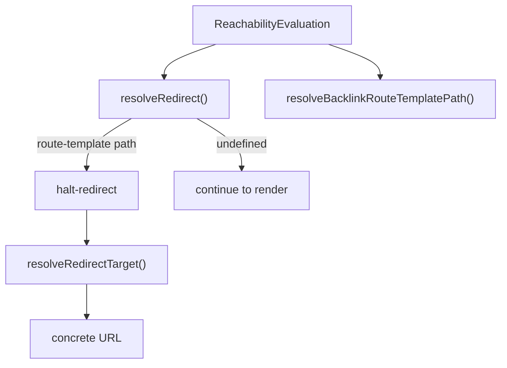

# Reachability Phase

## Scope

This document covers `packages/forge-core/src/engine/concerns/reachability/runtime`.

This code runs the `request.reachability` phase and turns the finished evaluation into a redirect decision.
It calls the compiled facts and state functions, decides whether a request should redirect and to which route-template path, and derives the current step's backlink.

This document does not cover building the reachability evaluation.
The graph walk, path/frontier/resume, and projection are compiled in [../lowering/graph](../lowering/graph) and run as the compiled state function; `RequestReachabilityWorkHandler` orchestrates the phase and stores the result before this code runs.

## Background

By the time this code runs, the reachability evaluation already exists.

[`RequestReachabilityWorkHandler`](RequestReachabilityWorkHandler.ts) calls the compiled reachability facts function, then the compiled reachability state function, and stores the resulting `ReachabilityEvaluation` on the request context.
That evaluation already knows which steps are reachable, the default entry, the frontier, and the resume outcome.

What is left is a routing decision.
Given that evaluation, should the request continue to render, or halt and redirect, and if so to which step?
That is the question this folder answers.
Turning the resulting route-template path into a concrete URL is the [route](../../route/README.md) concern's job, in `redirectTarget.ts`.

## Responsibilities

- Decide whether a step or journey request should redirect, and to which route-template path.
- Choose the frontier path when a resume should jump forward.
- Fall back to the configured unreachable target when a requested step is unreachable.
- Derive the backlink route-template path for the current step.

## Data Model

`resolveRedirect()` receives:
- `evaluation`, the `ReachabilityEvaluation` produced by the compiled state function.
- `nodeKind`, `'step'` or `'journey'`.
- `method`, the request `HttpMethod`.

It returns the route-template path to redirect to, or `undefined` to continue the pipeline.

`resolveBacklinkRouteTemplatePath()` receives the `ReachabilityEvaluation` and returns the current step's predecessor on the canonical path, or `undefined` when there is none.

`resolveRedirectTarget()` receives:
- `target`, a redirect string or an already-parsed target.
- `location`, the request `origin`, `pathname`, and optional `basePath`.

It returns a `ResolvedRedirectTarget` with `kind`, `value`, and `pathname`.

`ParsedRedirectTarget` classifies a target as `external` (an `http(s)` URL), `absolute` (a `/`-rooted path), or `relative`.

### Example

A reachable step on a `GET` continues; an unreachable one redirects to the configured fallback:

```ts
resolveRedirect(evaluation, 'step', 'GET') // undefined — continue to render
resolveRedirect(unreachableEvaluation, 'step', 'GET') // '/apply/check-answers'
```

`RequestReachabilityWorkHandler` turns a returned path into a `halt-redirect`.
`RequestPipeline` later resolves that route-template path to a concrete URL:

```ts
resolveRedirectTarget('/apply/check-answers', snapshot.location)
// { kind: 'absolute', value: '/apply/check-answers', pathname: '/apply/check-answers' }
```

## Flow



- [reachabilityRedirects.ts](reachabilityRedirects.ts) decides the redirect and backlink route-template paths from the evaluation.
  `RequestReachabilityWorkHandler` reads the redirect; `RequestResolveWorkHandler` reads the backlink.
- [redirectTarget.ts](../../route/runtime/redirectTarget.ts) classifies a redirect target and resolves it into a concrete URL.
  It belongs to the [route](../../route/README.md) concern; `RequestPipeline` calls it once a phase has chosen to redirect.

## Boundaries

- The compiled state function owns building the evaluation.
  These helpers read `ReachabilityEvaluation`; they never rebuild reachability or re-evaluate authored expressions.
- `resolveRedirect` owns the redirect decision; it returns a target or `undefined`.
  `RequestReachabilityWorkHandler` owns whether that target halts the pipeline.
- `redirectTarget` owns string-to-URL resolution.
  It runs from `RequestPipeline`, after a phase has chosen to redirect.
- Route-template paths stay distinct from resolved URLs.
  Redirect decisions work in route templates; `resolveRedirectTarget` resolves the target against the request origin and base path. Route params are substituted earlier, before it runs.

## Quirks

- `resolveRedirect` returns `undefined` to mean "do not redirect".
  A reachable step on a normal request continues to render rather than redirecting.
- Journey requests always redirect.
  They resolve to the frontier on a resume redirect, otherwise the default entry; a missing target is an error the handler raises.
- On step requests, a resume redirect only applies to `GET`.
  A resume outcome on a non-GET step request does not jump to the frontier; the unreachable check applies instead.
- Relative targets distinguish dot-relative from base-relative.
  `./` and `../` resolve against the current pathname; a bare relative path resolves against the base path when one is set.
- Path templates encode `:` while resolving.
  `resolveRedirectTarget` percent-encodes `:` so the URL parser keeps route-template params, then decodes them back.

## Constraints

- Run reachability evaluation before this code.
  `resolveRedirect` and `resolveBacklinkRouteTemplatePath` assume a finished `ReachabilityEvaluation`.
- Do not mutate the evaluation.
  These helpers only read it; the phase has already stored it on the context.
- Keep the redirect decision and the URL resolution separate.
  One produces a route-template path; the other turns a path or authored target into a URL.

## Editing Notes

- To change when a request redirects, start in `resolveRedirect()`.
- To change the unreachable fallback, start in `resolveUnreachableRedirect()`.
- To change the backlink, start in `resolveBacklinkRouteTemplatePath()`.
- To change how targets become URLs, start in `resolveRedirectTarget()` and `parseRedirectTarget()`.
- To change how the evaluation is built, edit [../lowering/graph](../lowering/graph), not this folder.

## Entry Points

- [reachabilityRedirects.ts](reachabilityRedirects.ts) answers whether a request redirects and to which route-template path.
- [RequestReachabilityWorkHandler.ts](RequestReachabilityWorkHandler.ts) answers how the phase runs the compiled functions and turns a redirect path into `halt-redirect`.
- [redirectTarget.ts](../../route/runtime/redirectTarget.ts) answers how a redirect target string becomes a concrete URL.
