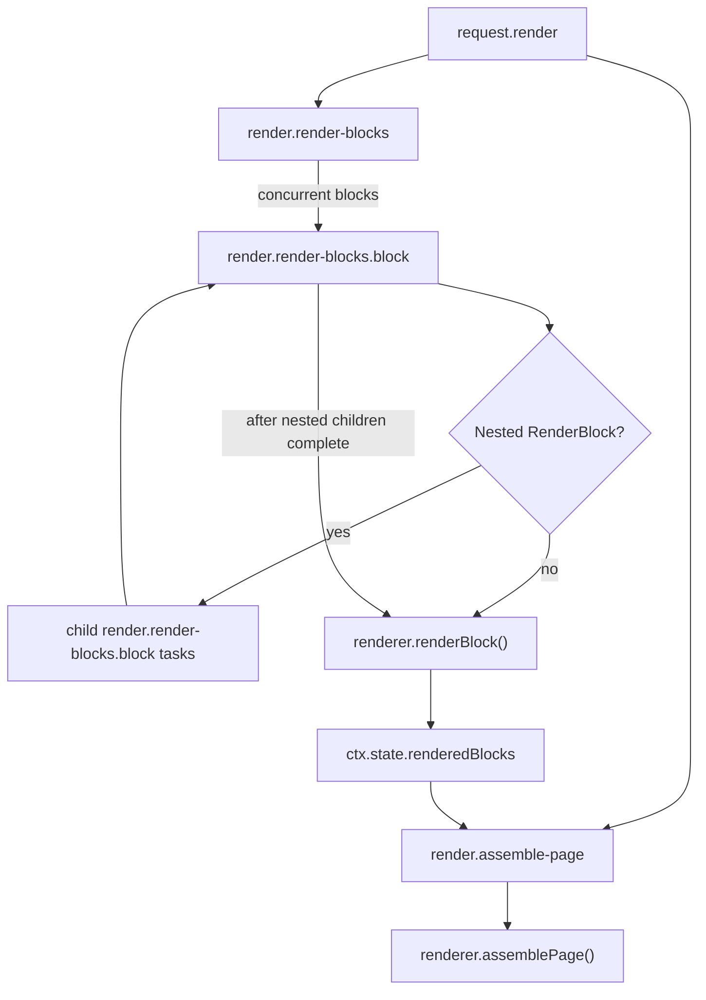

# Render Phase

## Scope

This document covers `packages/forge-core/src/engine/concerns/render/runtime`.

This code renders resolved blocks and assembles final renderer output.
It calls the configured `ForgeRenderer` with evaluated blocks, rendered nested blocks, and request state.

This document does not cover resolve, component registration, or renderer implementations.

## Background

Render is the final renderer-facing phase.

Resolve has already produced `RenderBlock` values.
Those blocks still need to be passed through the component registry and the configured `ForgeRenderer`.
Some block properties can contain nested `RenderBlock` values.
Render handles those nested blocks before calling `renderer.renderBlock()` for the parent.

The resolved block data is not enough because framework adapters need renderer output.
For example, an in-process renderer may return HTML strings, while another renderer could return another output shape.
This phase treats renderer output as `unknown` and only controls order and nesting.
The `RenderContext` already contains the effective inherited view at `step.view`; renderers do not need to resolve journey view precedence.

## Responsibilities

- Fail when a resolved block has no registered component entry.
- Render visible top-level blocks.
- Render nested `RenderBlock` values inside block properties.
- Omit invisible block trace units where possible.
- Store `ctx.state.renderedBlocks`.
- Assemble final page output through `renderer.assemblePage()`.

## Data Model

`RenderBlocksWorkProps` contains:
- `blocks`, the resolved `RenderBlock[]`.
- `renderer`.
- `componentRegistry`.

`RenderBlockWorkProps` contains:
- `block`, the resolved `RenderBlock`.
- `entry`, the component registry entry.
- `renderer`.
- `componentRegistry`.

`RenderAssemblePageWorkProps` contains:
- `renderContext`.
- `renderer`.

`EvaluatedBlock` is the renderer-facing block shape.
`RenderBlockWorkHandler` converts `RenderBlock` to `EvaluatedBlock` by spreading block properties over the block type and variant fields.

### Example

A resolved field block:

```ts
{
  id: 'compile_ast:1',
  variant: 'text-input',
  blockType: 'BlockType.field',
  properties: { code: 'name', value: 'Ada' },
}
```

is passed to the renderer as:

```ts
{
  type: StructureType.BLOCK,
  variant: 'text-input',
  blockType: 'BlockType.field',
  code: 'name',
  value: 'Ada',
}
```

## Flow



- [RenderBlocksWorkHandler.ts](RenderBlocksWorkHandler.ts) creates child render-block tasks and stores rendered block output.
- [RenderBlockWorkHandler.ts](RenderBlockWorkHandler.ts) renders one block and recursively renders nested blocks in properties.
- [RenderAssemblePageWorkHandler.ts](RenderAssemblePageWorkHandler.ts) calls `renderer.assemblePage()`.

## Boundaries

- Resolve owns producing `RenderBlock` values.
  Render should not run compiled resolve functions.
- Component registry owns finding component entries.
  Render throws when a resolved block has no entry, because compilation should already have registered every variant.
- `ForgeRenderer` owns actual block and page rendering.
  Runtime render should only call `renderBlock()` and `assemblePage()`.
- Request render owns the phase split.
  This folder assumes `renderContext` already exists.
- Request resolve owns view inheritance.
  Renderers consume `context.step.view` without combining the individual evaluated views retained on `context.ancestors`.

## Quirks

- Missing component entries are runtime errors.
  Normal compiled journeys should not reach this state because semantic analysis validates block variants.
- Invisible blocks return an empty string.
  They call `omitFromTrace()` so empty branch noise is reduced.
- Nested render blocks are rendered before the parent block.
  Parent properties are replaced with nested renderer output.
- `render.render-blocks` stores output on `ctx.state.renderedBlocks`.
  `render.assemble-page` reads that shared value in the next request-render child group.
- Renderer output is `unknown`.
  Runtime does not assume HTML.

## Constraints

- Keep `render.render-blocks` before `render.assemble-page`.
  Page assembly needs `ctx.state.renderedBlocks`.
- Keep nested block rendering inside `RenderBlockWorkHandler`.
  Component renderers should receive nested renderer output, not raw `RenderBlock` objects.
- Throw for missing component entries.
  Silent skips hide broken compiled packages or runtime registry drift.
- Keep invisible block output as an empty string.
  Changing it affects renderer output arrays.

## Editing Notes

- To change top-level block rendering, start in `RenderBlocksWorkHandler`.
- To change one block's renderer input, start in `toEvaluatedBlock()` in `RenderBlockWorkHandler.ts`.
- To change nested block replacement, start in `RenderBlockWorkHandler`.
- To change page assembly, start in `RenderAssemblePageWorkHandler`.
- To change unknown component handling, update `RenderBlocksWorkHandler`, `RenderBlockWorkHandler`, and missing-entry tests.

## Entry Points

- [RequestRenderWorkHandler.ts](RequestRenderWorkHandler.ts) answers how a stored `RenderContext` becomes renderer output.
- [RenderBlocksWorkHandler.ts](RenderBlocksWorkHandler.ts) answers how resolved blocks become rendered block output.
- [RenderBlockWorkHandler.ts](RenderBlockWorkHandler.ts) answers how one block and its nested blocks are rendered.
- [RenderAssemblePageWorkHandler.ts](RenderAssemblePageWorkHandler.ts) answers how rendered blocks become final renderer output.
