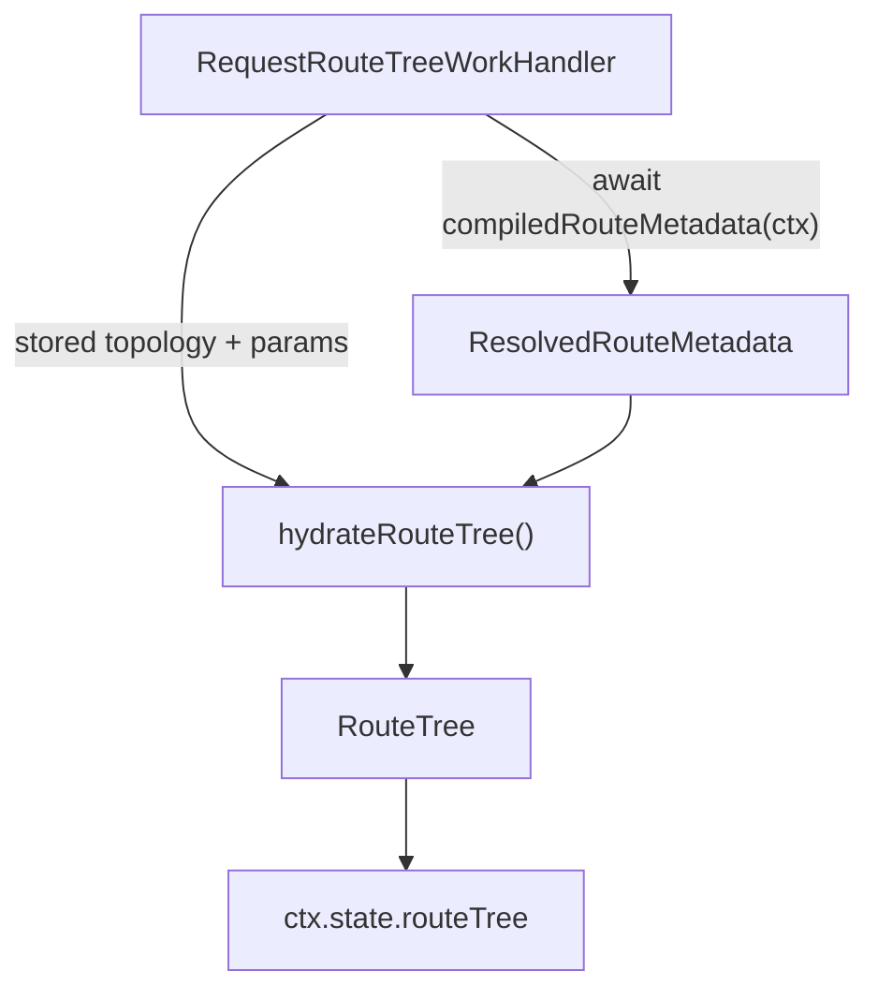

# Route Runtime

## Scope

This document covers `packages/forge-core/src/engine/concerns/route/runtime`.

This code builds the route topology at mount, hydrates it into per-request render route-tree data, and resolves redirect targets into concrete URLs.
Hydration resolves `:param` placeholders, marks the active branch, and merges the resolved route metadata onto each node.

This document does not cover the package-level route-metadata compiler or render context assembly.

## Background

Route topology (segments, template paths, parent/child, node IDs) is built once at mount by [RouteTreeBuilder.ts](RouteTreeBuilder.ts), which `MountRegistry` calls while it turns a `CompiledPackage` into mounted nodes.
Title, description, and metadata are authored as expressions, so they cannot live on that static tree.

The route-tree phase runs just before resolve on step requests.
Its request handler ([RequestRouteTreeWorkHandler.ts](RequestRouteTreeWorkHandler.ts)) evaluates the
package-level `compiledRouteMetadata` function once, then calls `hydrateRouteTree` to merge the resolved metadata onto the
stored topology by node ID. It publishes the result on `ctx.state.routeTree`, which the resolve phase reads when assembling
`RenderContext`.

Redirect targets are the other half of this folder.
Once any phase has chosen to redirect, `RequestPipeline` calls `resolveRedirectTarget()` to turn a route-template path or an authored target string into a concrete URL against the request origin and base path.

## Responsibilities

- Build `RouteTreeIndex`, `StoredRouteTree`, and the journey route-template catalog from compiled route indexes at mount.
- Resolve `:param` placeholders in stored template paths.
- Mark the active branch for the current step.
- Merge resolved `title`/`description`/`metadata` onto each node by node ID.
- Leave route metadata for nodes absent from the resolved map as `undefined`.
- Classify a redirect target as external, absolute, or relative, and resolve it into a concrete URL.

## Data Model

`hydrateRouteTree(routeTree, currentStepPath, params, routeMetadata)` takes:
- `routeTree`, the `StoredRouteTree` (topology only) from the mounted node.
- `currentStepPath`, the current step's template path, used for active state.
- `params`, the request params used to resolve `:param` placeholders.
- `routeMetadata`, the `ResolvedRouteMetadata` produced by the route-tree phase handler.

It returns a `RouteTree` of `RouteTreeNode`s, each carrying resolved `path`, `active`, `metadata`, and an optional
`route` with `title`/`description`/`metadata` looked up from `routeMetadata` by node ID.

## Flow

## Boundaries

- This folder owns turning a stored route tree into render route-tree data.
  It should not evaluate authored expressions — the compiled route-metadata function does that in the handler.
- The route-tree request handler owns metadata evaluation and stashing.
  Resolve owns reading `ctx.state.routeTree` into `RenderContext`.
- `RouteTreeBuilder` owns route topology from compiled route indexes.
  It should not resolve request outcomes.
- `redirectTarget` owns string-to-URL resolution only.
  Deciding whether to redirect belongs to the phase that halts, usually [reachability](../../reachability/README.md).

## Editing Notes

- To change how metadata merges onto nodes, start in `hydrateRouteTree.ts`.
- To change when metadata is evaluated or where it is stashed, start in [RequestRouteTreeWorkHandler.ts](RequestRouteTreeWorkHandler.ts).
- To change route tree shape, start in [RouteTreeBuilder.ts](RouteTreeBuilder.ts), then check mounted node creation in `MountRegistry`.
- To change how targets become URLs, start in `resolveRedirectTarget()` and `parseRedirectTarget()` in [redirectTarget.ts](redirectTarget.ts).

## Entry Points

- [hydrateRouteTree.ts](hydrateRouteTree.ts) answers how a stored route tree plus resolved metadata becomes a render route tree.
- [RequestRouteTreeWorkHandler.ts](RequestRouteTreeWorkHandler.ts) answers where the compiled route metadata is evaluated.
- [RouteTreeBuilder.ts](RouteTreeBuilder.ts) answers how compiled route indexes become runtime route-tree data.
- [redirectTarget.ts](redirectTarget.ts) answers how a redirect target string becomes a concrete URL.
