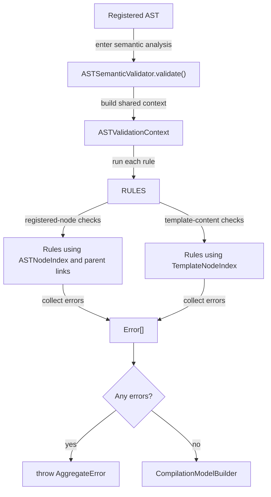

# AST Semantic Analysis

## Scope

This document covers `packages/forge-core/src/engine/concerns/semantic-analysis`.

This code validates a registered AST before analysis and code generation run.
It checks that AST nodes are used in places where they're allowed and that referenced functions and components exist.

This document does not cover AST creation, AST registration, dependency planning, runtime evaluation, or generated output.

Like [dsl-validation](../dsl-validation/README.md), this concern has no stage folders: the whole pass runs once
during compilation, between AST building and analysis, so there is nothing to lower or execute per
request. It sits under `concerns/` rather than the compilation chassis because it is self-contained gate logic,
not orchestration or shared machinery — `CompilationPipeline.validateSemantics()` calls in from the chassis.

## Background

Semantic analysis checks whether the AST makes sense for the Forge compiler.

The AST phase has already turned the authored journey into typed nodes.
That means semantic analysis can ask structural questions against `ASTNodeIndex` and each node's `parent` link instead of searching the raw DSL.
For example, it can ask "is this `FunctionType.EFFECT` inside a hook?", "is this `ExpressionType.VALIDATION` inside `validWhen`?", and "is this block variant registered?".

To some degree, the earlier [DSL validation](../dsl-validation/README.md) stage protects the broad shape
of the authored definition. It can check that a value looks like an iterator, a reference, a hook, or a block.
That's about it, it cannot decide whether those values are semantically valid in their current position.
For example, Zod can accept an `Item()` reference because the reference has the right shape.
It cannot know that `Item()` is invalid outside an `Iterator`. You can imagine it a bit like type rules and domain rules.

This check matters because the next compiler phases expect these rules to already hold.
Code generation expects effect functions to live in hook phases.
Validation planning expects validation expressions to live under `validWhen`.
Iterator references such as `Item()` and `Loop` only make sense when the node is inside an iterator template.
Semantic analysis rejects those cases before they turn into confusing failures later.

## Responsibilities

- Run every AST validation rule against the same `ASTValidationContext`.
- Collect all semantic errors that can be found in one pass.
  - Reject unregistered function names and component variants.
  - Reject references that escape the available iterator scope.
  - Reject nodes that are valid AST nodes but illegal in their current container.
  - Validate iterator templates that are intentionally not registered as normal AST descendants.
  - *Note: The above rules fall out of the rules implemented, obviously can change in future - the phase isn't tied
    to these specifically!*

## Data Model

Semantic analysis has a small data model.

`ASTValidationContext` contains:
- `nodeIndex`, an `ASTNodeIndex` used to find registered nodes by broad type or subtype.
- `templateNodeIndex`, a `TemplateNodeIndex` used to find template contents by the same types.
- `functionRegistry`, a `FunctionRegistry` used to check function names.
- `componentRegistry`, a `ComponentRegistry` used to check block variants.

Parent and ancestor relationships are inspected through the `parent` link on each registered node.
A `TemplateNodeEntry` carries `owningNode`, the registered node that holds the template, so a rule can also inspect the ancestry of template contents.

An `ASTValidationRule` is a function that accepts `ASTValidationContext` and returns `readonly Error[]`.
Rules do not throw directly.
`ASTSemanticValidator.validate()` runs each rule, appends the returned errors, and throws one `AggregateError` when any errors exist.

Most rules inspect registered nodes through `ASTNodeIndex.findByType()` and template contents through `TemplateNodeIndex.findByType()`.
Templates are AST-shaped, but they are not registered in `ASTNodeIndex`.
The registration walk indexes their contents in `TemplateNodeIndex` instead, so most template checks are bucket lookups.
Only depth-sensitive and path-sensitive checks still walk templates by hand.

### Example

A submit hook can contain effect functions.
The same effect is invalid when it appears as a field value.

Authors may accidentally write:

```jsonc
{
  type: 'StructureType.Block',
  blockType: 'BlockType.field',
  variant: 'GovUKInput',
  code: 'firstName',
  defaultValue: {
    type: 'FunctionType.Effect',
    name: 'saveToApi',
    arguments: [],
  },
}
```

AST creation still turns that function into an expression node:

```jsonc
{
  id: 'compile_ast:4',
  type: 'AstNode.Expression',
  expressionType: 'FunctionType.Effect',
  properties: {
    name: 'saveToApi',
    arguments: [],
  },
  diagnostics: {
    source: {
      path: ['steps', 0, 'blocks', 0, 'defaultValue'],
      formattedPath: 'travel-declaration > personal-details > blocks[0] (GovUKInput - firstName) > defaultValue',
    },
  },
}
```

`validateEffectScope()` then walks the node's `parent` links to find its ancestors.
If no ancestor has `ASTNodeType.HOOK`, it returns a `ForgeReferenceScopeError` with code `effect_outside_hook`.
`ASTSemanticValidator.validate()` includes that error in the final `AggregateError`.

*Note: Pretty sure the DSL Validation stage would catch this, but suspend disbelief for the example please!*

## Flow

Semantic analysis is a rule pass driven by `CompilationPipeline.validateSemantics()`.
It runs after `CompilationPipeline.buildAstTree()` has created and registered the AST.
It runs before analysis and lowering.



- [ASTSemanticValidator.ts](ASTSemanticValidator.ts) owns rule orchestration.
  It builds the shared context, runs the `RULES` array in order, and throws `AggregateError` when errors were collected.
- [rules/types.ts](rules/types.ts) defines the shared rule contract.
  Every rule gets the same registry and AST structures.
- [rules/validateReferenceScopes.ts](rules/validateReferenceScopes.ts) validates `@scope` and `@loop` references.
  It uses ancestor iterator depth for registered nodes and explicit template depth for iterator templates.
- [rules/validateEffectScope.ts](rules/validateEffectScope.ts), [rules/validateOutcomeScope.ts](rules/validateOutcomeScope.ts), [rules/validateHookScope.ts](rules/validateHookScope.ts), [rules/validateTieBreakerScope.ts](rules/validateTieBreakerScope.ts), [rules/validateValidationScope.ts](rules/validateValidationScope.ts), [rules/validateStructureScope.ts](rules/validateStructureScope.ts), [rules/validateBlockScope.ts](rules/validateBlockScope.ts), and [rules/validateFunctionArguments.ts](rules/validateFunctionArguments.ts) validate where AST node families are allowed to appear.
- [rules/validateRegisteredFunctions.ts](rules/validateRegisteredFunctions.ts) checks all `FunctionType` expression nodes and function template nodes against `FunctionRegistry`.
- [rules/validateFunctionArity.ts](rules/validateFunctionArity.ts) checks each function expression's authored argument count against the arity of its registered `argumentsSchema` tuple.
- [rules/validateRegisteredComponents.ts](rules/validateRegisteredComponents.ts) checks all block variants against `ComponentRegistry`.
- [rules/validateContainerTypes.ts](rules/validateContainerTypes.ts) checks arrays such as `onAccess`, `onSubmission`, `blocks`, `effects`, and `next` for the node types later phases expect.

## Boundaries

- `ASTSemanticValidator` owns rule execution.
  It should not contain individual semantic checks.
- Validation rules own semantic checks.
  They should return errors and should not throw unless the error is an unexpected programming failure.
- Semantic analysis reads `ASTNodeIndex`, `TemplateNodeIndex`, and node `parent` links.
  It should not create nodes, register nodes, index nodes, or mutate nodes.
- Registry validation reads `FunctionRegistry` and `ComponentRegistry`.
  It should not register missing functions or components.
- Scope rules own compile-time placement checks.
  Runtime evaluation should not need to re-check whether an effect, outcome, hook, validation, or tie-breaker was legal.
- Template checks read `TemplateNodeIndex`, which the AST phase builds during registration.
  They should not make template nodes ordinary registered AST descendants.

## Quirks

- Rules collect errors instead of throwing immediately.
  This lets one bad journey report multiple semantic problems in one `AggregateError`.
- Iterator templates are checked separately from registered nodes.
  Template nodes are not in `ASTNodeIndex`, so a rule that only queries it will miss errors inside `yieldTemplate` and `predicateTemplate`.
  A rule with a template case queries `templateNodeIndex.findByType()` next to its registered-node query.
- `validateReferenceScopes()` cannot use `TemplateNodeIndex` for its template case.
  The flat index erases iterator nesting, and `Item()` and `Loop` levels depend on that nesting, so the rule keeps a local depth-tracking walk.
- `validateReferenceScopes()` treats iterate input differently from iterate templates.
  The input expression is outside the iterator's item scope, but the yield and predicate templates are inside that scope.
- `validateValidationScope()` tracks the IDs that are direct entries of `validWhen`.
  A validation expression is allowed there, but the same expression is rejected in `defaultValue` or arbitrary block content.
- `validateContainerTypes()` catches structurally valid nodes in the wrong arrays.
  For example, an effect expression is valid AST, but it is not a valid `next` entry.
- Source diagnostics are attached when a node has them, not guaranteed.
  Rules use `node.diagnostics?.source` when it's there and fall back to `unknown` when a node has no source path.

## Constraints

- Run semantic analysis after AST registration.
  Rules depend on `ASTNodeIndex.findByType()` and the `parent` links wired during registration.
- Run semantic analysis before analysis and lowering.
  Later phases assume the AST has already been checked for legal placement and registered dependencies.
- Keep validation rules side-effect free.
  A rule that mutates nodes or registries can change what later rules see.
- Return errors from rules instead of throwing them.
  Throwing early prevents `ASTSemanticValidator` from reporting the rest of the semantic failures.
- Check templates when a rule applies to values inside iterators.
  Registered-node checks do not see template-only nodes.
- Do not treat iterate input as inside the iterator item scope.
  `Item()` and `Loop` are only available in the iterator body, not in the collection expression that creates that scope.
- Preserve the rule order deliberately.
  The current order reports reference and placement errors before container-shape errors.
- Keep error source paths attached when possible.
  Diagnostics use those paths to point authors back to the DSL location that caused the failure.

## Editing Notes

- To add a new semantic check, create a rule in `rules/` and add it to the `RULES` array in `ASTSemanticValidator.ts`.
  Match the existing rule shape: gather `Error[]`, return it, and leave orchestration to `ASTSemanticValidator`.
- To validate a registered AST node family, start with `nodeIndex.findByType()`.
  Use broad types such as `ASTNodeType.BLOCK` or indexed subtypes such as `FunctionType.EFFECT` when the index supports them.
- To validate ancestor or parent placement, walk `node.parent` links.
  Do not infer ancestry from source paths.
- To validate iterator templates, query `templateNodeIndex.findByType()` with the same broad type or subtype as the registered-node case.
  Use the entry's `owningNode` when the verdict depends on where the template sits in the registered tree.
  Fall back to a local walk only when the check depends on template structure the flat index cannot express, as `validateReferenceScopes()` does for iterator depth.
- To add a new function subtype, make sure `validateRegisteredFunctions()` sees it through `Object.values(FunctionType)`.
  If the subtype has special placement rules, add a separate scope rule.
- To add a new component-like structure, decide whether it is a block variant checked by `ComponentRegistry`.
  If it is not a block, do not add it to `validateRegisteredComponents()` by shape alone.
- To add a new array property that accepts only one kind of node, update `validateContainerTypes()`.
  This protects later phases from receiving valid AST nodes in the wrong container.
- To change iterator reference behavior, start in `validateReferenceScopes.ts`.
  Keep registered-node depth and template depth aligned, because nested iterators use both paths.
- Be super careful adding new rules as you can quite quickly knock out people's configs if you're not
  careful with your implementation!

## Entry Points

- [ASTSemanticValidator.ts](ASTSemanticValidator.ts) runs the semantic rule set and raises the aggregate failure.
- [rules/types.ts](rules/types.ts) defines `ASTValidationContext` and `ASTValidationRule`.
- [rules/validateReferenceScopes.ts](rules/validateReferenceScopes.ts) answers whether `Item()` and `Loop` references are valid in the current iterator depth.
- [rules/validateRegisteredFunctions.ts](rules/validateRegisteredFunctions.ts) answers whether every referenced function name exists.
- [rules/validateFunctionArity.ts](rules/validateFunctionArity.ts) answers whether each function call supplies an argument count the function's tuple schema accepts.
- [rules/validateRegisteredComponents.ts](rules/validateRegisteredComponents.ts) answers whether every block variant exists.
- [rules/validateEffectScope.ts](rules/validateEffectScope.ts) answers whether effect functions appear inside hooks.
- [rules/validateOutcomeScope.ts](rules/validateOutcomeScope.ts) answers whether outcomes appear inside hooks.
- [rules/validateHookScope.ts](rules/validateHookScope.ts) answers whether hooks appear on journeys or steps.
- [rules/validateTieBreakerScope.ts](rules/validateTieBreakerScope.ts) answers whether tie-breakers appear in step reachability.
- [rules/validateValidationScope.ts](rules/validateValidationScope.ts) answers whether validation expressions appear in `validWhen`.
- [rules/validateStructureScope.ts](rules/validateStructureScope.ts) answers whether steps sit in a journey's `steps` array and journeys sit at the root or in a journey's `children` array.
- [rules/validateBlockScope.ts](rules/validateBlockScope.ts) answers whether blocks sit in a step's `blocks` array or nested within another block.
- [rules/validateFunctionArguments.ts](rules/validateFunctionArguments.ts) answers whether function arguments contain illegal block definitions.
- [rules/validateContainerTypes.ts](rules/validateContainerTypes.ts) answers whether constrained arrays contain the node families later phases expect.
