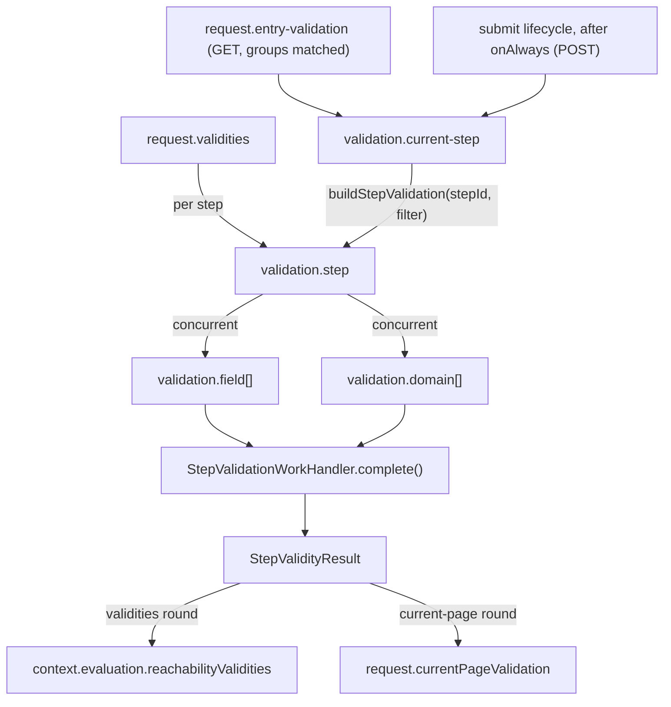

# Validation Phase

## Scope

This document covers `packages/forge-core/src/engine/concerns/validation/runtime`.

This code runs compiled step validation tasks and stores their results for the two validation rounds:
reachability validities for navigation, and the current-page result for hook branches and rendering.

This document does not cover semantic validation, generated validation source, submit hook ordering, or request phase ordering.

## Background

Forge has two validation rounds with separate orchestration and separate result stores, because they answer
different questions:

- The reachability round answers "which steps could the user navigate through", for the reachability walk.
- The current-page round answers "did the page handling this request pass, and what should render show".

Rule selection happens at execution time: every run passes a `ValidationRuleFilter` down to the compiled
validation function, which skips rules outside the active groups (and `submissionOnly` rules unless included)
before evaluating any rule condition. Stored results are therefore already filtered — validity is just "no
failures recorded".

The current-page round has one implementation (`validation.current-step`) and two legitimate triggers:
matching `validateOnEntry` conditions on GET, and the submit lifecycle after `onAlways` on POST. The triggers
cannot be unified into one because submit validation must stay at its position in the hook lifecycle
(`when → guards → onAlways → validation → onValid/onInvalid`) — `onAlways` may transform data that validation
depends on.

## Responsibilities

- Run field validation tasks concurrently.
- Run domain validation tasks concurrently.
- Fold child failures into `StepValidityResult`.
- Store reachability-round results by `NodeId` in `reachabilityValidities`.
- Store the current-page result on `RequestState.currentPageValidation`.
- Build step validation tasks from compiled validation functions.
- Keep field failure `blockId` available for resolve.

## Data Model

`StepValidationWorkProps` contains:
- `fields`, the `FieldValidationWorkTask` list.
- `domains`, the `DomainValidationWorkTask` list.

`FieldValidationWorkProps` contains:
- `blockId`, the render block identity used later by resolve.
- `blockCode`, the field answer code, kept as metadata.
- `run()`, the compiled function that returns `StepValidationFailure[]`.

`DomainValidationWorkProps` contains `run()`, the compiled function that returns `DomainValidationFailure[]`.

`CurrentStepValidationWorkProps` is the `ValidationRuleFilter` both triggers supply:
- entry validation passes `{ groups: matchingEntryGroups, includeSubmissionOnly: false }`.
- the submit lifecycle passes `{ groups: hook.validationGroups, includeSubmissionOnly: true }`.

`StepValidityResult` stores `fieldFailures` and `domainFailures`.

`ValidationView` is the current-page read model with `isValid` plus the failure lists.

`context.evaluation.reachabilityValidities` stores reachability-round `StepValidityResult` values keyed by step
`NodeId`. `RequestState.currentPageValidation` stores the one current-page `ValidationView`; its
presence is the display signal.

## Flow

- [ReachabilityValiditiesWorkHandler.ts](ReachabilityValiditiesWorkHandler.ts) fans out every validating step under the reachability filter and records navigation facts.
- [RequestEntryValidationWorkHandler.ts](RequestEntryValidationWorkHandler.ts) runs the compiled `validateOnEntry` selector and schedules `validation.current-step` when groups match.
- [CurrentStepValidationWorkHandler.ts](CurrentStepValidationWorkHandler.ts) owns the current-page operation and its result store.
- [StepValidationWorkHandler.ts](StepValidationWorkHandler.ts) runs field and domain validation children and folds failures.
- [FieldValidationWorkHandler.ts](FieldValidationWorkHandler.ts) calls one compiled field validation `run()`.
- [DomainValidationWorkHandler.ts](DomainValidationWorkHandler.ts) calls one compiled domain validation `run()`.
- [stepValidationStore.ts](stepValidationStore.ts) builds and re-keys validation tasks from compiled validation functions.
- [reachabilityValidityState.ts](reachabilityValidityState.ts) writes the reachability validity map.

## Boundaries

- Work handlers own task execution and output folding.
- `validation.current-step` owns the complete current-page operation: rule selection (via the filter it passes
  down), execution, validity, and the result store. Triggers only decide whether and with what filter it runs.
- Hooks own sequencing; they never construct validation results or set rendering flags.
- The reachability round never touches `currentPageValidation` or validation display.
- Resolve derives the public render shape from the presence of `currentPageValidation`; it does not decide
  whether validation should be displayed.
- Resolve owns attaching failures to rendered fields. Validation must keep `blockId`, but it should not mutate
  render props.

## Quirks

- Field and domain validations both run concurrently.
  The folded failure arrays still follow child order, because `WorkExecutor` preserves the group order when it returns completed child work.
- Group and `submissionOnly` filtering happen inside the generated function, before rule conditions are
  evaluated. A stored result only ever contains failures from rules the filter selected.
- Missing stored validity means valid.
  A step with no validation task should not block reachability.
- The reachability round includes the current step. Resume and frontier resolution need its navigation
  validity, and the round runs before either current-page trigger could supply one. The result is a navigation
  fact only and never reaches display.
- A present `currentPageValidation` may be valid with no failures — "validation ran and passed" is distinct
  from "validation did not run", and render surfaces both.

## Constraints

- Preserve `blockId` on `StepValidationFailure`.
  Resolve uses it to match failures to rendered fields by block identity.
- Keep `validationTaskKey(stepId)` stable.
  The validities phase maps completed child work back to step IDs through that key.
- Keep `isStepValidationWorkTask()` strict.
  It prevents unrelated work tasks from being recorded as validation.
- Only `CurrentStepValidationWorkHandler` may write `currentPageValidation`; only
  `ReachabilityValiditiesWorkHandler` may write `reachabilityValidities`.

## Editing Notes

- To change validation execution order, start in `StepValidationWorkHandler`.
  Preserve folded failure order unless the caller explicitly wants a different display order.
- To change rule filtering, edit the lowering validation compiler — filtering is generated code, not a runtime helper.
- To change the current-page operation or its result, start in `CurrentStepValidationWorkHandler`.
- To change how compiled validation is wrapped for runtime, start in `stepValidationStore.ts`.
- To change generated validation failures, edit the lowering validation compiler instead.

## Entry Points

- [ReachabilityValiditiesWorkHandler.ts](ReachabilityValiditiesWorkHandler.ts) answers how the `request.validities` phase populates navigation validity facts before reachability.
- [RequestEntryValidationWorkHandler.ts](RequestEntryValidationWorkHandler.ts) answers how GET entry conditions trigger current-page validation.
- [CurrentStepValidationWorkHandler.ts](CurrentStepValidationWorkHandler.ts) answers how the current page is validated and displayed.
- [StepValidationWorkHandler.ts](StepValidationWorkHandler.ts) answers how validation child tasks run.
- [FieldValidationWorkHandler.ts](FieldValidationWorkHandler.ts) answers how one field validation runs.
- [DomainValidationWorkHandler.ts](DomainValidationWorkHandler.ts) answers how one domain validation runs.
- [stepValidationStore.ts](stepValidationStore.ts) answers how compiled validation is converted to runtime work.
- [reachabilityValidityState.ts](reachabilityValidityState.ts) answers how navigation validity is stored on `RuntimeContext`.
